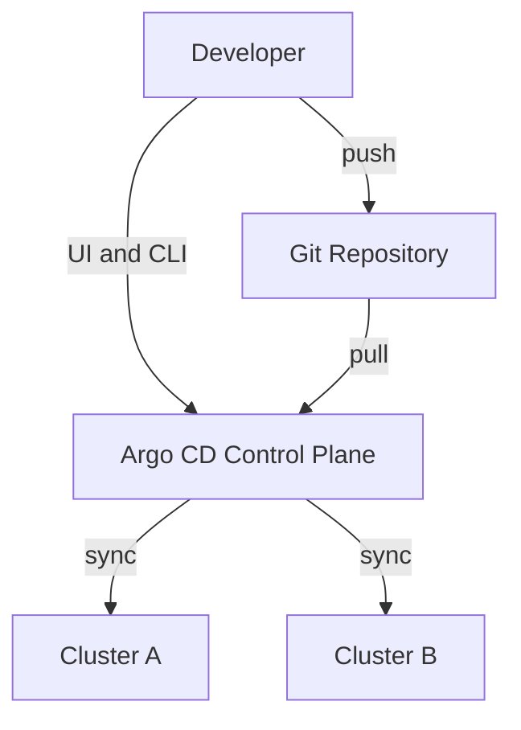
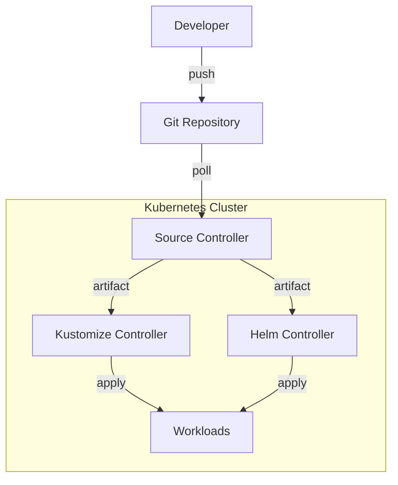
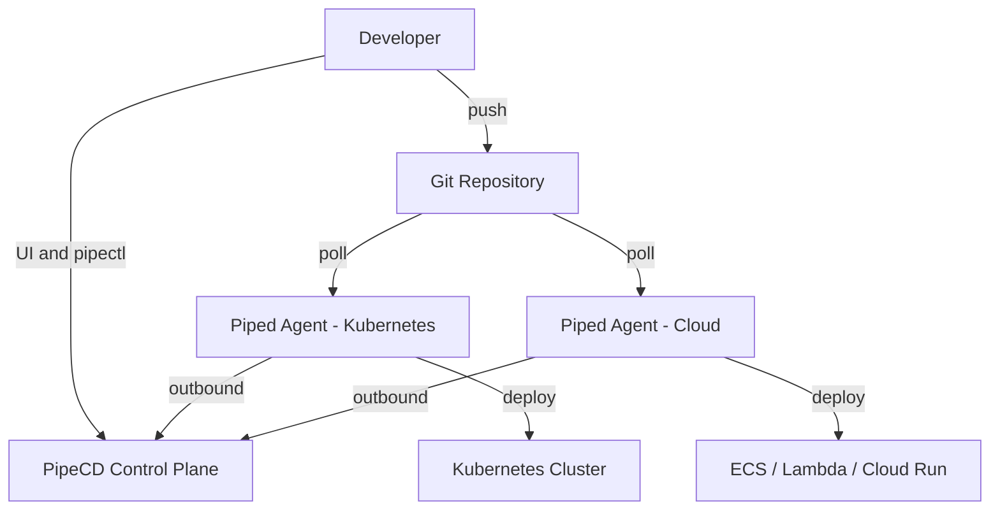

GitOps has become the go-to approach for Kubernetes continuous delivery in cloud-native environments. By using Git as the single source of truth for infrastructure and application configuration, teams can achieve more consistent deployments, better auditability, and easier rollback strategies across Kubernetes environments.

As GitOps adoption has grown, several tools have emerged to help teams automate and manage these workflows. Three projects that are frequently part of that conversation are [Argo CD](https://argo-cd.readthedocs.io/en/stable/), [Flux CD](https://fluxcd.io/), and [PipeCD](https://pipecd.dev/). While all three are built around GitOps principles, they differ significantly in architecture, deployment philosophy, platform support, operational complexity, and developer experience.

The important question is not “Which GitOps tool is the best?” A better question is: Which tool best fits your infrastructure, team workflow, and delivery requirements? A startup running a few Kubernetes clusters may prioritize simplicity and fast onboarding, while a larger platform team managing hybrid environments may need progressive delivery, multi-platform deployments, and centralized control.

In this blog, we compare Argo CD, Flux CD, and PipeCD across architecture, usability, deployment capabilities, scalability, and real-world use cases to help you determine which GitOps tool is the right fit for your team.

## What is Argo CD?

Argo CD is one of the most widely adopted GitOps tools and has become a common choice for teams looking to implement pull-based continuous delivery workflows for Kubernetes environments. As a CNCF graduated project, it has a mature ecosystem, extensive community support, and strong integrations with Kubernetes-native tooling.

Argo CD is often recognized for its UI-first experience, which gives teams visibility into application state, sync status, and deployment history out of the box. It is primarily designed for Kubernetes environments, making it especially appealing to teams running containerized workloads and looking for a relatively approachable GitOps workflow with strong ecosystem backing.

## What is Flux CD?

Flux CD takes a more modular approach to continuous delivery. Also a CNCF graduated project, Flux is built around a collection of Kubernetes controllers that handle different responsibilities such as source synchronization, Helm releases, and Kustomize deployments.

Unlike Argo CD, Flux does not provide a native UI by default and is generally considered more CLI- and API-oriented. Many teams prefer Flux for its composability, lightweight architecture, and strong support for Helm and Kustomize workflows. It is often adopted by engineering teams that want a more Kubernetes-native and automation-driven GitOps experience with minimal abstraction layers.

## What is PipeCD?

PipeCD is a continuous delivery platform designed to support GitOps workflows across multiple infrastructure types from a single control plane. In addition to Kubernetes, PipeCD supports platforms such as AWS Lambda, ECS, Terraform, and Cloud Run. Progressive delivery comes built in rather than relying on separate tooling, and its agent-based architecture executes deployments through lightweight Piped agents running inside target environments. While PipeCD is currently a CNCF Sandbox project and less widely adopted than Argo CD or Flux CD, it focuses on simplifying multi-platform delivery operations under a unified deployment model.

## Feature comparison

Feature | Argo CD | Flux CD | PipeCD
--- | --- | --- | ---
Primary focus | Kubernetes GitOps CD | Kubernetes GitOps toolkit | Multi-platform continuous delivery
CNCF maturity | Graduated | Graduated | Sandbox
Native UI / dashboard | Rich web UI included | No native UI by default | Rich web UI included
Deployment model | Pull-based GitOps | Pull-based GitOps | Pull-based GitOps
GitOps architecture style | Centralized control plane managing clusters | Distributed controllers inside cluster | Separate control plane with in-cluster Piped agents
Supported platforms | Kubernetes | Kubernetes | Kubernetes, ECS, Lambda, Terraform, Cloud Run
Progressive delivery | Via Argo Rollouts | Via Flagger | Built-in
Helm support | Yes | Strong native support | Yes
Kustomize support | Yes | Strong native support | Yes
Drift detection | Yes | Yes | Yes
Secret management | Integrates with Vault, Sealed Secrets, SOPS | Commonly paired with SOPS and External Secrets Operator | Integrates with external secret management solutions
RBAC / multi-tenancy | Yes | Yes | Yes
Agent-based architecture | No | No | Yes
Installation complexity | Moderate | Moderate; more controller-oriented setup | Moderate; requires control plane + Piped agents
Extensibility | Strong plugin ecosystem | Highly composable controllers | Platform-provider model
Operational model | UI-driven application management | API/CLI-driven workflows | Centralized multi-platform delivery management
Best suited for | Kubernetes-focused teams wanting strong UI | Teams preferring composable Kubernetes-native workflows | Teams managing mixed infrastructure across platforms

## Architecture differences

Although all three tools follow a GitOps model, their internal architectures are designed quite differently, and those differences can affect operational complexity, scalability, security, and day-to-day management.

### Argo CD

Argo CD uses a centralized architecture made up of several core components, including an API server, application controller, repository server, and Redis for caching and state management. This architecture gives Argo CD a rich feature set and strong UI-driven operational experience, but it also means there are more moving parts to deploy and manage.

Over time, the project has matured significantly, and its architecture is well documented with a large ecosystem of integrations, plugins, and community resources available for troubleshooting and extension.

### Flux CD

Flux CD takes a modular approach by separating responsibilities across multiple Kubernetes controllers. Different controllers handle concerns such as Git source synchronization, Helm releases, image automation, and Kustomize reconciliation independently.

This design aligns closely with Kubernetes controller patterns and gives teams flexibility to adopt only the components they need. The tradeoff is that Flux can feel more fragmented for teams expecting a centralized UI or tightly integrated management experience, especially during initial setup and troubleshooting.

### PipeCD

PipeCD uses an agent-based architecture built around lightweight Piped agents that run inside target environments or clusters. The control plane itself can be self-hosted or managed separately, while deployment execution happens through the agents.

This approach allows PipeCD to support deployments across multiple infrastructure platforms from a single control plane. It also offers security advantages for organizations with strict network boundaries or internal cluster policies, since clusters do not require broad inbound access from an external deployment system.

## Operational experience

Argo CD is often considered easier to onboard because of its UI-first experience, which gives teams a clear visual view of application states, sync status, and deployment history. For many teams, this also makes debugging and day-to-day operations simpler, especially when troubleshooting deployments.

Flux CD is often preferred by Kubernetes-native teams that value automation and a lightweight operational model. Its modular architecture gives teams flexibility and strong control over workflows, particularly when working heavily with Helm and Kustomize.

Because Flux does not provide a centralized UI out of the box, debugging and troubleshooting may feel more challenging for some teams, especially those newer to GitOps workflows.

PipeCD focuses on providing a unified operational experience across multiple platforms and deployment targets. Its built-in progressive delivery capabilities reduce the need for additional tooling, helping teams simplify their deployment stack.

## When should you use each tool?

The most useful question is which tool aligns best with your environment and deployment strategy.

### Choose Argo CD if:

- Your workloads primarily run on Kubernetes.
- Your team values a rich UI and visual deployment management.
- You want a large ecosystem with extensive community support.
- Your engineers are already familiar with Argo-based workflows.
- You want easier onboarding for teams new to GitOps.

Argo CD is often the default starting point for teams adopting GitOps in Kubernetes environments because of its maturity and strong ecosystem. The built-in UI makes it easier to visualize application state, deployment history, sync status, and drift detection without relying heavily on CLI tooling.

### Choose Flux CD if:

- You prefer a more GitOps-native and Kubernetes-native approach.
- Your workflows rely heavily on Helm and Kustomize.
- Your team prefers CLI/API-driven operations over dashboards.
- You want highly modular and composable controllers.
- Your engineers are comfortable working directly with Kubernetes primitives.

Flux CD is often favored by teams that want GitOps tooling to feel deeply integrated into Kubernetes itself. Its controller-based architecture gives teams flexibility to adopt only the components they need while keeping workflows highly customizable.

### Choose PipeCD if:

- You manage infrastructure beyond Kubernetes.
- Your environment includes services like Terraform, ECS, Lambda, or Cloud Run.
- You want progressive delivery capabilities built into the platform.
- You prefer a single control plane for deployments across platforms.
- Your organization has stricter network or security boundaries.

PipeCD is designed for teams managing heterogeneous infrastructure where Kubernetes is only part of the deployment landscape. Instead of combining multiple deployment systems for different platforms, PipeCD aims to unify deployments through a single control plane and agent-based architecture.

## Adoption and migration considerations

Choosing a GitOps platform is not only a technical decision but also an operational one. Teams evaluating a new tool often need to consider existing workflows, ecosystem investments, onboarding complexity, and whether the migration effort will provide meaningful operational benefits.

Many organizations discover that the question is not whether one platform is objectively better than another, but whether changing tools solves a problem they are currently facing.

### Moving from Argo CD

Organizations already using Argo CD may have significant operational investment in its ecosystem, especially if teams rely heavily on its UI-driven workflows, plugin integrations, and Kubernetes-centric deployment model.

For teams operating primarily within Kubernetes environments, there may not be a strong reason to migrate away from Argo CD unless they begin encountering limitations around multi-platform delivery workflows, deployment fragmentation, or operational scaling across different infrastructure types.

### Moving from Flux CD

Flux CD is often deeply integrated into Kubernetes-native platform engineering workflows. Teams that value composability, controller-based architecture, and CLI-driven operations may prefer Flux because it aligns closely with Kubernetes design principles and infrastructure-as-code practices.

However, the modular nature of Flux can also introduce additional operational complexity for teams looking for a more centralized management experience.

### Evaluating PipeCD

PipeCD’s strongest differentiator tends to emerge in environments where organizations are already managing deployments across multiple platforms and tools. Teams may separately manage Kubernetes deployments, Terraform infrastructure, serverless functions, and cloud services using different CI/CD systems and operational processes.

In those cases, the appeal of PipeCD is less about replacing Kubernetes GitOps entirely and more about unifying delivery workflows under a single control plane and deployment model.

## Decision matrix

If your team wants… | Consider…
--- | ---
Rich UI + large ecosystem | Argo CD
Kubernetes-native composability | Flux CD
Unified multi-platform delivery | PipeCD
Built-in progressive delivery | PipeCD
Simpler GitOps onboarding | Argo CD
CLI/API-first workflows | Flux CD

## Key takeaways

- Argo CD is strong for Kubernetes-focused teams wanting UI visibility and ecosystem maturity.
- Flux CD fits teams preferring composable Kubernetes-native workflows.
- PipeCD stands out for organizations managing infrastructure beyond Kubernetes.
- The best choice depends more on operational needs than feature count.

## Conclusion

There is no universally “best” GitOps tool, only the one that best aligns with your infrastructure, operational model, and team workflow. Argo CD, Flux CD, and PipeCD are all strong projects with active communities and proven deployment models, but they solve slightly different problems in practice.

For teams running Kubernetes workloads, Argo CD and Flux CD remain battle-tested choices. Argo CD often appeals to organizations that value a rich UI, strong ecosystem support, and easier onboarding, while Flux CD tends to fit teams that prefer a more Kubernetes-native, composable, and CLI-driven workflow.

PipeCD stands out in environments where deployments extend beyond Kubernetes alone. Teams managing combinations of Kubernetes, Terraform, ECS, Lambda, or Cloud Run may benefit from having a single delivery control plane instead of stitching together multiple deployment tools. Its built-in progressive delivery support and agent-based architecture also make it an interesting option for organizations balancing operational simplicity with stricter infrastructure boundaries.

Ultimately, the right choice depends less on popularity and more on how well the tool matches the way your team builds, deploys, and operates software.

If you’d like to explore PipeCD further, check out the [PipeCD documentation](https://pipecd.dev/docs/), [PipeCD GitHub repository](https://github.com/pipe-cd/pipecd), and the [PipeCD Slack community](https://slack.cncf.io/).
