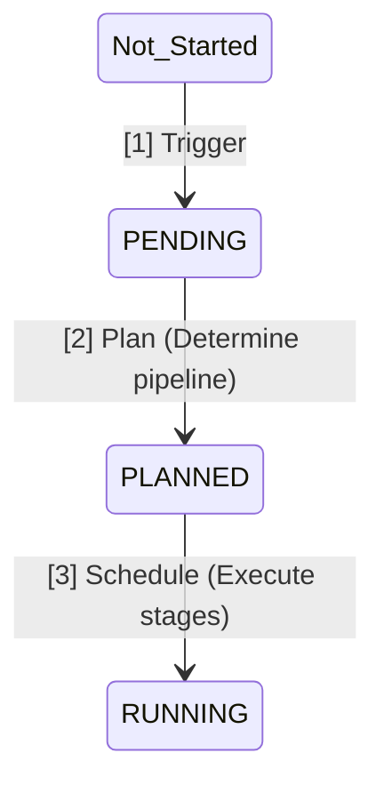
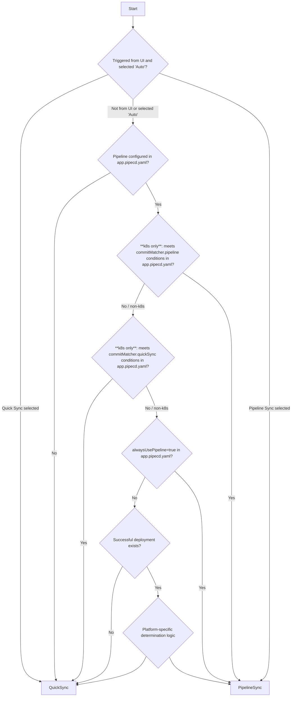

This article explains the process before a deployment begins in PipeCD. Since PipeCD is pull-based, there are various processes that take place before a deployment starts.

Probably, you have felt "What is Pending??" at least once:


The target audience is those who want to:
- troubleshoot when "deployment doesn't start as expected..."
- understand GitOps mechanisms and implementation
- contribute to PipeCD


_This article is based on PipeCD v0.51.2 (latest version at time of writing). The specifications in the [plugin version](https://zenn.dev/cadp/articles/pipecd-plugin-intro) are slightly different._


_This article omits discussion of [Deployment Chain](https://pipecd.dev/docs-v0.51.x/user-guide/managing-application/deployment-chain/) (due to complexity)._

## Overview

The state transitions before deployment begins are shown in the diagram below.



Phases [1] through [3] are **executed asynchronously by separate components (goroutines)**. This mechanism allows deployment to resume even if Piped crashes during the process.


## 1. Trigger

PipeCD initiates application deployment through four types of triggers:

- [A] Detecting changes in Git (main method)
  - Includes integration from CI through [EventWatcher](https://pipecd.dev/docs/user-guide/managing-piped/configuring-event-watcher/)
- [B] Manual start from UI/pipectl
- [C] Automatic deployment on drift detection (requires configuration)
- [D] Deployment Chain (details omitted)

The above four points can be configured [`trigger`](https://pipecd.dev/docs-v0.51.x/user-guide/configuration-reference/#deploymenttrigger) in `app.pipecd.yaml`. **Only [C] is disabled by default**.

#### [A] Detecting changes in Git

This occurs when the following two conditions are met after fetching the latest commit from the Git repository:

1. There are new commits that haven't been deployed
2. There is at least one change in files at the same level or below `app.pipecd.yaml`

For 2., the detection scope can be adjusted using [`paths`/`ignores` settings](https://pipecd.dev/docs-v0.51.x/user-guide/configuration-reference/#oncommit). This allows detection of changes in shared template files located in different directories, for example.

#### [B] Manual trigger from UI/pipectl

This is a push-style pattern.

From the UI, you can start it on the Application page. This is convenient for cases like "redeploying after a deployment failure due to environment issues rather than application issues."

You can also start it from pipectl using the [following command](https://pipecd.dev/docs-v0.51.x/user-guide/command-line-tool/#syncing-an-application). This is useful for cases like "direct deployment from CI (exceptionally) or workflows."
```sh
pipectl application sync --app-id={app-id}
```

#### [C] Automatic deployment on drift detection (requires configuration)

This occurs when there's a difference between the Git definition (=desired state) and the actual environment. PipeCD has a separate mechanism called [Drift Detection](https://pipecd.dev/docs-v0.51.x/user-guide/managing-application/configuration-drift-detection/) that continuously detects drifts.

This trigger is disabled by default, and manual repair is the basic approach after drift detection. This trigger is for those who want to strictly treat Git as the Single Source of Truth.

Deployment is triggered when an application meets all four of the following conditions:

1. "Automatic deployment on drift detection" is enabled
   - Set the `trigger.onOutOfSync.disabled` item to `true` (**default is `false`**)
2. Drift has occurred (status is `OutOfSync`)
3. Not currently deploying
4. A specified time has passed since the last deployment (default is 5 minutes)
   - This prevents the scenario where "deployment completes but the drift detection mechanism is delayed, causing false drift detection and deployment"
   - Can be configured with the `trigger.onOutOfSync.minWindow` item

https://pipecd.dev/docs-v0.51.x/user-guide/configuration-reference/#onoutofsync

#### Trigger code

See the `trigger` package, `trigger.go` is the entry point and `determiner.go` determines whether to deploy or not.

Personally, reading the `trigger` package significantly improves understanding of PipeCD's behavior.

https://github.com/pipe-cd/pipecd/blob/v0.51.2/pkg/app/piped/trigger/

## 2. Plan: Determine Pipeline

This phase determines "how to deploy using which pipeline." It mainly does two things:

1. Determine whether to use Quick Sync or Pipeline Sync
2. Determine stages

The planner instance runs as a goroutine in a 1:1 relationship with Deployment, allowing multiple deployments to be processed concurrently.
Also, piped is implemented to prevent multiple deployments from running simultaneously for the same application.

#### 2.1. Determining Quick Sync or Pipeline Sync

##### What are Quick Sync and Pipeline Sync?

PipeCD has two deployment strategies:

- **Quick Sync**
  - Executes deployment with a single stage (`K8S_SYNC` or `ECS_SYNC`, etc.)
  - Optimal for cases where "only Git synchronization is needed, no analysis required"

- **Pipeline Sync**
  - Executes deployment according to a defined pipeline
  - Optimal for cases requiring staged deployment like Canary deployment

##### Strategy determination logic

**Quick Sync is selected when any of the following conditions are met:**

- [A] User manually starts deployment from UI selecting "Quick Sync"
- [B] No `pipeline` is configured in `app.pipecd.yaml`
- [C] (k8s only) Conditions in `app.pipecd.yaml`'s [`planner.commitMatcher.quickSync`](https://pipecd.dev/docs-v0.51.x/user-guide/configuration-reference/#commitmatcher) are met
- [D] (except Terraform) No successful deployment exists for that application
- [E] (k8s only) No changes in workload or config ([details](https://pipecd.dev/docs-v0.51.x/user-guide/managing-application/defining-app-configuration/kubernetes/#quick-sync))

**Pipeline Sync is selected when any of the following conditions are met:**
- [A] User manually starts deployment from UI selecting "Pipeline Sync"
- [B] `planner.alwaysUsePipeline` is set to `true` in `app.pipecd.yaml` (default is `false`)
- [C] (k8s only) Conditions in `app.pipecd.yaml`'s [`planner.commitMatcher.pipeline`](https://pipecd.dev/docs-v0.51.x/user-guide/configuration-reference/#commitmatcher) are met

The detailed decision flowchart is like this:


#### 2.2. Determining Stages

There's not much noteworthy here.

- For Quick Sync:
  - Since there's no user-defined pipeline, generates stages like `K8S_SYNC` for K8s or `ECS_SYNC` for ECS

- For Pipeline Sync:
  - Generates stages according to the user-defined pipeline

#### Planner code

The core logic of Plan is implemented per platform in the `planner` package. The `controller` package controls its execution.

https://github.com/pipe-cd/pipecd/blob/v0.51.2/pkg/app/piped/planner/kubernetes/kubernetes.go

## 3. Schedule: Execute Pipeline

The scheduler component manages pipeline progression. It mainly does two things:

1. Execute each stage of the pipeline
2. Execute rollback on failure

Like the planner, the scheduler instance runs as a goroutine in a 1:1 relationship with Deployment, allowing multiple deployments to be processed concurrently.

#### 3.1. Executing Each Stage of the Pipeline

Executes each stage sequentially based on the pipeline generated in the Plan phase.
Specific processing content varies by platform.

#### 3.2. Executing Rollback on Failure

If any stage fails, executes the rollback stage.
Like 3.1., the rollback stage name and processing content vary by platform.

#### Scheduler code

The `Run()` and `executeStage()` methods in `scheduler.go` of the `controller` package are important.

https://github.com/pipe-cd/pipecd/blob/v0.51.2/pkg/app/piped/controller/scheduler.go#L191-L661

The specific processing logic of each stage is in the [`executor` package](https://github.com/pipe-cd/pipecd/blob/v0.51.2/pkg/app/piped/executor/).
The `executor` package describes "execute this process in this stage," making it relatively easy to understand.

## Appendix: What is the controller? 

This section is intended for those interested in code reading.

The controller is the manager of the planner and scheduler. Users don't need to be aware of it.

The controller package, which contains the planner and scheduler, includes code related to deployment flow control. The [`controller.go`](https://github.com/pipe-cd/pipecd/blob/v0.51.2/pkg/app/piped/controller/controller.go) is the entry point, and the controller runs continuously from Piped startup.

The controller performs the following every 10 seconds:
- Create planner/scheduler for new deployments if needed
- Delete completed planner/scheduler
- Notify planner/scheduler when a user cancels deployment

## Conclusion

While PipeCD has many other features and code, the trigger and controller form its core.
I hope this helps find which code to get hints when you think "it would be nice if PipeCD had a feature like xxx."

