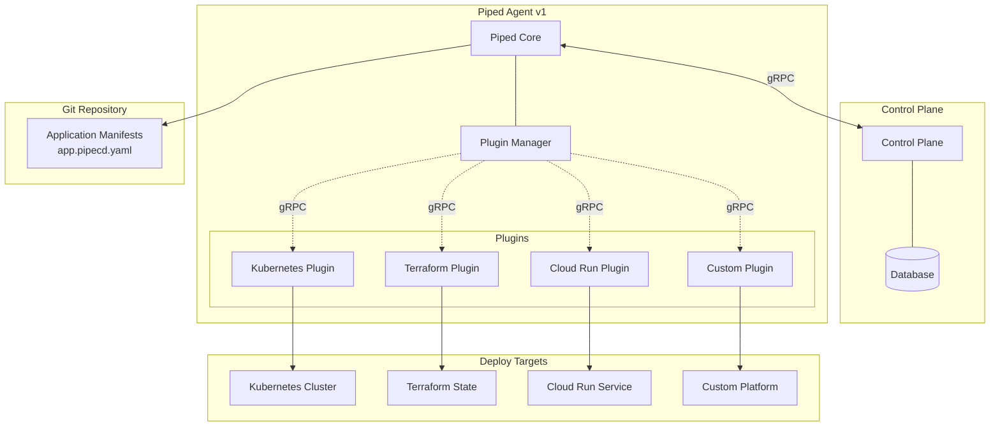
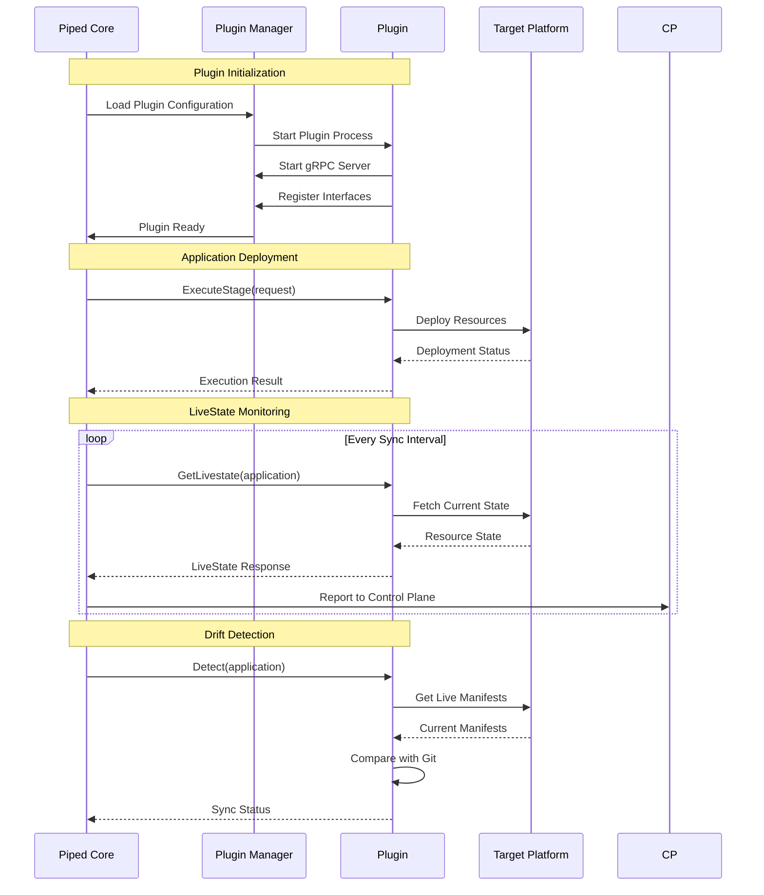
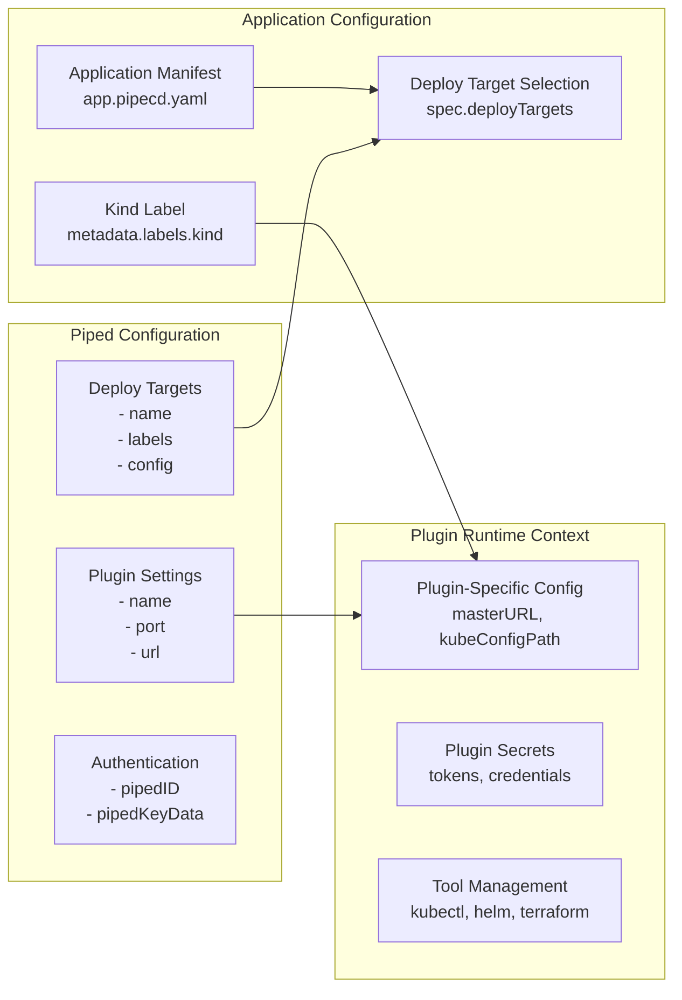
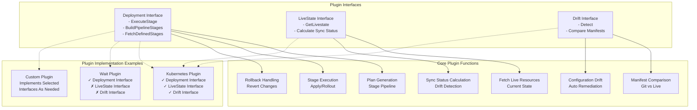
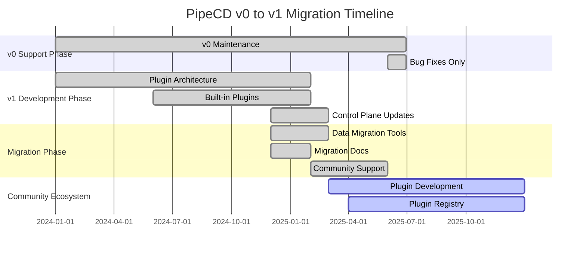

# PipeCD v1: Plugin Architecture Documentation


## Table of Contents

- [Overview](#overview)
- [Architecture Overview](#architecture-overview)
- [Plugin Types and Interfaces](#plugin-types-and-interfaces)
- [Getting Started](#getting-started)
- [Plugin Development](#plugin-development)
- [Migration Guide](#migration-guide)
- [Configuration Reference](#configuration-reference)
- [Examples](#examples)
- [Troubleshooting](#troubleshooting)
- [Contributing](#contributing)
- [Resources](#resources)

## Overview

PipeCD v1 introduces a revolutionary plugin architecture that transforms PipeCD from a monolithic continuous delivery system into an extensible, plugin-based platform. This architecture enables PipeCD to achieve its vision of becoming "**The One CD for All {applications, platforms, operations}**" by allowing the community to extend support for any deployment platform through custom plugins.

### Key Benefits

- **Extensibility**: Support for any deployment platform through custom plugins
- **Community-Driven**: Plugin ecosystem developed and maintained by the community
- **Backward Compatibility**: Seamless coexistence with existing PipeCD v0 installations
- **Modularity**: Plugins can implement specific interfaces (Deployment, LiveState, Drift) as needed
- **Performance**: gRPC-based communication for efficient plugin interactions

### Current Status (as of August 2025)

- **Initial Release**: February 2025 (released)
- **Development Status**: General Availability (GA); ongoing improvements and plugin ecosystem growth
- **Plugin SDK**: Available with Go implementation
- **Built-in Plugins**: Kubernetes, Terraform, Cloud Run, ECS, Lambda
- **Control Plane Support**: Released; updates and enhancements ongoing ([#5252](https://github.com/pipe-cd/pipecd/issues/5252))
- **Migration Support**: Tools and documentation available for v0 to v1 migration

### Control Plane Updates Required

The plugin architecture requires significant updates to the PipeCD Control Plane to support:

- **Deploy Targets**: Replace platform providers with plugin-based deploy targets
- **Application Labels**: Support `metadata.labels.kind` instead of `spec.kind`
- **Plugin Metadata**: Handle plugin-specific deployment metadata
- **UI Updates**: Display plugin-based deployments and configurations
- **API Changes**: Support new data structures for applications and deployments

## Architecture Overview

The plugin architecture introduces a clear separation between the PipeCD core system and platform-specific deployment logic. This design enables unlimited extensibility while maintaining system reliability and performance.

### High-Level Architecture



### Plugin Communication Protocol



### Configuration Context Separation



## Plugin Types and Interfaces

The plugin architecture defines three main interfaces that plugins can implement. Each interface serves a specific purpose in the deployment lifecycle.

### Interface Overview



### 1. Deployment Interface

The Deployment Interface handles the core deployment logic, including planning, stage execution, and rollback operations.

**Key Responsibilities:**
- Generate deployment plans based on application manifests
- Execute individual deployment stages
- Handle rollback procedures
- Manage deployment state transitions

**gRPC Service Methods:**
```protobuf
service DeploymentService {
  rpc FetchDefinedStages(FetchDefinedStagesRequest) returns (FetchDefinedStagesResponse);
  rpc BuildPipelineStages(BuildPipelineStagesRequest) returns (BuildPipelineStagesResponse);
  rpc ExecuteStage(ExecuteStageRequest) returns (ExecuteStageResponse);
  rpc FetchTrafficStatus(FetchTrafficStatusRequest) returns (FetchTrafficStatusResponse);
}
```

### 2. LiveState Interface

The LiveState Interface provides real-time visibility into deployed resources and their synchronization status.

**Key Responsibilities:**
- Fetch current state of deployed resources
- Compare live state with desired state
- Calculate application synchronization status
- Support drift detection workflows

**gRPC Service Methods:**
```protobuf
service LivestateService {
  rpc GetLivestate(GetLivestateRequest) returns (GetLivestateResponse);
}
```

### 3. Drift Interface

The Drift Interface enables detection of configuration drift between deployed resources and Git-stored manifests.

**Key Responsibilities:**
- Compare live manifests with Git manifests
- Detect configuration differences
- Provide detailed drift reports
- Support automated drift remediation

## Getting Started

### Prerequisites

- Go 1.24 or later
- Access to a PipeCD Control Plane
- Target deployment platform (Kubernetes, etc.)

### Quick Start with Built-in Plugins

1. **Set up Control Plane Connection**

   Access your PipeCD Control Plane console and create a new Piped agent. Copy the generated Piped ID and key for configuration.

2. **Build Plugin Binaries**

   ```bash
   make build/plugin
   ```

3. **Create Piped Configuration**

   ```yaml
   apiVersion: pipecd.dev/v1beta1
   kind: Piped
   spec:
     projectID: quickstart
     pipedID: YOUR_PIPED_ID
     pipedKeyData: YOUR_BASE64_ENCODED_KEY
     apiAddress: localhost:8080
     repositories:
     - repoId: example
       remote: git@github.com:your-org/your-repo.git
       branch: main
     syncInterval: 1m
     plugins:
     - name: kubernetes
       port: 7003
       url: file:///path/to/.piped/plugins/kubernetes
       deployTargets:
       - name: kubernetes-dev
         labels:
           env: dev
           cluster: us-east-1
         config:
           masterURL: https://your-k8s-cluster
           kubeConfigPath: /path/to/kubeconfig
           kubectlVersion: "1.33.0"
   ```

4. **Run the Piped Agent**

   ```bash
   make run/piped CONFIG_FILE=piped-config.yaml EXPERIMENTAL=true
   ```

### Application Configuration

Update your application manifest to use the new plugin architecture:

```yaml
apiVersion: pipecd.dev/v1beta1
kind: Application
metadata:
  labels:
    kind: KUBERNETES  # Replaces the old 'kind' field
spec:
  name: myapp
  deployTargets:
    - kubernetes-dev  # References deploy target from Piped config
  plugins:
    kubernetes:  # Must match plugin name in Piped config
      input:
        namespace: default
        manifests:
          - deployment.yaml
          - service.yaml
```

## Plugin Development

### Creating a Custom Plugin

The PipeCD Plugin SDK provides everything needed to develop custom plugins. Here's a complete example:

1. **Initialize Plugin Project**

   ```go
   package main
   
   import (
       "log"
       sdk "github.com/pipe-cd/piped-plugin-sdk-go"
       "your-plugin/deployment"
       "your-plugin/livestate"
   )
   
   func main() {
       plugin, err := sdk.NewPlugin(
           "1.0.0",
           sdk.WithDeploymentPlugin(&deployment.Plugin{}),
           sdk.WithLivestatePlugin(&livestate.Plugin{}),
       )
       if err != nil {
           log.Fatalln(err)
       }
       if err := plugin.Run(); err != nil {
           log.Fatalln(err)
       }
   }
   ```

2. **Implement Deployment Interface**

   ```go
   package deployment
   
   import (
       "context"
       sdk "github.com/pipe-cd/piped-plugin-sdk-go"
   )
   
   type Plugin struct {
       // Plugin-specific fields
   }
   
   func (p *Plugin) Initialize(ctx context.Context, input *sdk.InitializeInput) error {
       // Initialize plugin resources
       return nil
   }
   
   func (p *Plugin) ExecuteStage(ctx context.Context, input *sdk.ExecuteStageInput) (*sdk.ExecuteStageResponse, error) {
       // Implement stage execution logic
       return &sdk.ExecuteStageResponse{
           Status: sdk.StageStatus_SUCCEEDED,
       }, nil
   }
   ```

3. **Implement LiveState Interface**

   ```go
   package livestate
   
   import (
       "context"
       sdk "github.com/pipe-cd/piped-plugin-sdk-go"
   )
   
   type Plugin struct {
       // Plugin-specific fields
   }
   
   func (p *Plugin) GetLivestate(ctx context.Context, input *sdk.GetLivestateInput) (*sdk.GetLivestateResponse, error) {
       // Fetch and return live state
       return &sdk.GetLivestateResponse{
           SyncState: sdk.ApplicationSyncState_SYNCED,
           // Additional live state data
       }, nil
   }
   ```

### Plugin Distribution

Plugins can be distributed through various methods:

- **GitHub Releases**: Host plugin binaries on GitHub releases
- **Container Registry**: Package plugins as container images  
- **Local File System**: Use local plugin binaries for development

```yaml
# Example plugin configuration with different sources
plugins:
- name: custom-plugin
  sourceURL: https://github.com/yourorg/plugin/releases/download/v1.0.0/plugin
  # or
  sourceURL: file:///usr/local/bin/custom-plugin
  # or  
  sourceURL: docker://yourregistry/plugin:v1.0.0
```

## Migration Guide

### Migration Timeline



### Control Plane Migration Requirements

The migration from v0 to v1 requires updates to multiple Control Plane components as tracked in [Issue #5252](https://github.com/pipe-cd/pipecd/issues/5252):

#### Core Data Model Changes

**Platform Provider → Deploy Target Migration:**
- `Application.platform_provider` field maintained for backward compatibility
- New `Application.deploy_targets` array field added
- `Deployment.deploy_targets_by_plugin` map replaces single platform provider
- Plugin metadata stored per deploy target

**Application Kind → Label Migration:**
- `Application.kind` field maintained for backward compatibility  
- New `Application.metadata.labels.kind` field added
- Built-in kind values: `KUBERNETES`, `TERRAFORM`, `CLOUDRUN`, `ECS`, `LAMBDA`
- Custom plugin kinds supported through labels

#### Component Updates Required

**LiveState Management:**
- LiveState store now groups by deploy target instead of platform provider
- LiveState reporter calls plugin gRPC interfaces
- Aggregation layer added for multi-target applications

**Deployment Execution:**
- Executor uses deploy targets and plugin interfaces
- Pipeline stages mapped to plugin-specific stage implementations
- Rollback procedures adapted for plugin architecture

**Drift Detection:**
- Detector calls plugin drift detection interfaces
- Configuration comparison updated for plugin-specific manifests
- Detection intervals configurable per plugin type

**Plan Preview:**
- Plan preview calls plugin plan generation interfaces
- Diff calculation performed by plugins for platform-specific logic
- Preview results aggregated across multiple deploy targets

**Web UI and API:**
- Application forms support deploy target selection
- Deployment views display plugin-specific information
- API responses include plugin metadata and deploy targets
- Metrics use deploy targets instead of platform providers

### Migration Steps

#### Step 1: Prepare Data Migration

Before upgrading to PipeCD v1, migrate your existing data:

```bash
# Use pipectl to migrate platform providers to deploy targets
pipectl migrate platform-providers --piped-config=piped-config.yaml

# Migrate application kinds to labels  
pipectl migrate application-kinds --project=your-project

# Validate migration results
pipectl validate --config piped-config.yaml
```

**Important Migration Notes:**
- Applications will maintain both `platform_provider` and `deploy_targets` fields during transition
- Application `kind` field will be duplicated as `metadata.labels.kind`  
- Control Plane components will be updated to handle both v0 and v1 data formats
- No service interruption during migration process

#### Step 2: Update Piped Configuration

Transform your existing configuration:

**Before (v0):**
```yaml
apiVersion: pipecd.dev/v1beta1
kind: Piped
spec:
  platformProviders:
  - name: kubernetes-dev
    type: KUBERNETES
    config:
      masterURL: https://cluster-dev
      kubeConfigPath: ./kubeconfig-dev
```

**After (v1):**
```yaml
apiVersion: pipecd.dev/v1beta1
kind: Piped
spec:
  plugins:
  - name: kubernetes
    port: 7003
    url: file:///path/to/kubernetes-plugin
    deployTargets:
    - name: kubernetes-dev
      labels:
        env: dev
        cluster: us-east-1
      config:
        masterURL: https://cluster-dev
        kubeConfigPath: ./kubeconfig-dev
        kubectlVersion: "1.33.0"
```

#### Step 3: Update Application Configurations

**Before (v0):**
```yaml
apiVersion: pipecd.dev/v1beta1
kind: Application
spec:
  name: myapp
  kind: KUBERNETES
  platformProvider: kubernetes-dev
```

**After (v1):**
```yaml
apiVersion: pipecd.dev/v1beta1
kind: Application
metadata:
  labels:
    kind: KUBERNETES
spec:
  name: myapp
  deployTargets:
    - kubernetes-dev
  plugins:
    kubernetes:
      input:
        namespace: default
        manifests:
          - deployment.yaml
          - service.yaml
```

## Configuration Reference

### Piped Configuration Schema

```yaml
apiVersion: pipecd.dev/v1beta1
kind: Piped
spec:
  projectID: string                    # Required: Project identifier
  pipedID: string                      # Required: Piped agent identifier
  pipedKeyData: string                 # Required: Base64 encoded piped key
  apiAddress: string                   # Required: Control plane gRPC address
  
  repositories:                        # Git repositories
  - repoId: string
    remote: string
    branch: string
    
  syncInterval: duration               # Default: 1m
  
  plugins:                             # Plugin configurations
  - name: string                       # Required: Plugin name
    port: int                          # Required: Plugin gRPC port
    url: string                        # Required: Plugin binary source
    deployTargets:                     # Deploy target definitions
    - name: string                     # Required: Deploy target name
      labels:                          # Optional: Target labels
        key: value
      config:                          # Plugin-specific configuration
        # Plugin-specific fields
```

### Application Configuration Schema

```yaml
apiVersion: pipecd.dev/v1beta1
kind: Application
metadata:
  name: string                         # Required: Application name
  labels:                              # Required: Application labels
    kind: string                       # Required: Application kind (KUBERNETES, TERRAFORM, etc.)
    # Additional custom labels
spec:
  name: string                         # Required: Application name
  deployTargets:                       # Required: Target deploy targets
    - string
  plugins:                             # Required: Plugin-specific configurations
    pluginName:                        # Must match plugin name in Piped config
      input:                           # Plugin-specific input configuration
        # Plugin-specific fields
      service:                         # Optional: Service resource reference
      workloads:                       # Optional: Workload resource references
```

## Examples

### Kubernetes Plugin Example

```yaml
# Piped Configuration
plugins:
- name: kubernetes
  port: 7003
  url: file:///usr/local/bin/kubernetes-plugin
  deployTargets:
  - name: staging
    labels:
      env: staging
      cluster: us-east-1
    config:
      masterURL: https://k8s-staging.company.com
      kubeConfigPath: /etc/kubeconfig/staging
  - name: production
    labels:
      env: production
      cluster: us-west-2
    config:
      masterURL: https://k8s-prod.company.com
      kubeConfigPath: /etc/kubeconfig/production
```

```yaml
# Application Configuration
apiVersion: pipecd.dev/v1beta1
kind: Application
metadata:
  labels:
    kind: KUBERNETES
    team: backend
spec:
  name: web-api
  deployTargets:
    - staging
    - production
  plugins:
    kubernetes:
      input:
        namespace: default
        manifests:
          - deployment.yaml
          - service.yaml
      service:
        name: web-api-service
      workloads:
        - name: web-api
```

### Multi-Platform Deployment

```yaml
# Piped with multiple plugins
plugins:
- name: kubernetes
  port: 7003
  url: file:///usr/local/bin/kubernetes-plugin
  deployTargets:
  - name: k8s-prod
    labels:
      env: production
    config:
      masterURL: https://k8s.company.com
      kubeConfigPath: /etc/kubeconfig
      kubectlVersion: "1.33.0"
      
- name: terraform
  port: 7004
  url: file:///usr/local/bin/terraform-plugin
  deployTargets:
  - name: aws-infrastructure
    labels:
      cloud: aws
      region: us-east-1
    config:
      region: us-east-1
      
- name: custom-platform
  port: 7005
  url: https://github.com/company/custom-plugin/releases/download/v1.0.0/plugin
  deployTargets:
  - name: custom-env
    labels:
      platform: custom
    config:
      endpoint: https://api.custom-platform.com
      token: ${CUSTOM_PLATFORM_TOKEN}
```

**Example Multi-Platform Application:**

```yaml
# Kubernetes Application
apiVersion: pipecd.dev/v1beta1
kind: Application
metadata:
  labels:
    kind: KUBERNETES
spec:
  name: web-service
  deployTargets:
    - k8s-prod
  plugins:
    kubernetes:
      input:
        namespace: production
        manifests:
          - k8s/
---
# Terraform Infrastructure
apiVersion: pipecd.dev/v1beta1
kind: Application
metadata:
  labels:
    kind: TERRAFORM
spec:
  name: aws-resources
  deployTargets:
    - aws-infrastructure
  plugins:
    terraform:
      input:
        moduleDir: terraform/aws
```

## Troubleshooting

### Common Issues

#### Plugin Connection Failures

**Issue**: Plugin fails to start or connect to Piped core.

**Solutions**:
1. Check plugin binary permissions and path
2. Verify port conflicts (ensure no other processes use the specified port)
3. Review plugin logs for initialization errors
4. Validate gRPC connectivity between plugin and Piped core

```bash
# Check plugin process
ps aux | grep your-plugin

# Test gRPC connectivity
grpcurl -plaintext localhost:7003 list

# View Piped logs with plugin information
kubectl logs -f piped-agent-pod | grep plugin
```

#### Configuration Validation Errors

**Issue**: Invalid plugin or application configuration.

**Solutions**:
1. Validate YAML syntax and structure
2. Check required fields (name, port, deployTargets)
3. Verify deploy target references match between Piped and Application configs
4. Review plugin-specific configuration requirements

```bash
# Validate configuration files
pipectl validate --config piped-config.yaml

# Check application configuration
pipectl app validate --config app.pipecd.yaml

# Test plugin-specific configuration
pipectl plugin validate --plugin kubernetes --config app.pipecd.yaml
```

#### Migration Issues

**Issue**: Data migration from v0 to v1 fails or produces inconsistent results.

**Solutions**:
1. **Always backup data** before running migration
2. Run migration tools in dry-run mode first to preview changes
3. Migrate incrementally (test environments first, then production)
4. Verify data integrity after each migration step
5. Keep v0 configuration as backup during transition period

```bash
# Dry-run migration to preview changes
pipectl migrate platform-providers --piped-config=piped-config.yaml --dry-run

# Backup current configuration
cp piped-config.yaml piped-config-backup.yaml

# Run migration with verification
pipectl migrate platform-providers --piped-config=piped-config.yaml --verify
```

#### Control Plane Compatibility

**Issue**: Plugin-based deployments not displaying correctly in UI or API responses missing plugin data (historical issue).

**Root Cause**: Control Plane components required updates to support plugin architecture ([#5252](https://github.com/pipe-cd/pipecd/issues/5252)).

**Current Status (August 2025):**
- ✅ Piped v1 with plugin support available
- ✅ Control Plane updates released
- ✅ Web UI supports plugin-based applications
- ✅ API supports deploy targets and plugin metadata

**Note**: If you encounter issues, ensure you are running the latest version of the control plane and web UI.

### Debug Mode

Enable debug mode for detailed logging:

```yaml
# Piped configuration
spec:
  logLevel: debug
  plugins:
  - name: kubernetes
    config:
      debug: true
```

### Plugin Health Checks

Monitor plugin health through metrics and logs:

```bash
# Check plugin status
curl http://localhost:8080/metrics | grep plugin_status

# View plugin-specific metrics
curl http://localhost:7003/health
```

## Contributing

### Plugin Development Guidelines

1. **Follow SDK Patterns**: Use the official Plugin SDK for consistency
2. **Implement Error Handling**: Provide meaningful error messages and recovery
3. **Add Comprehensive Tests**: Include unit tests and integration tests
4. **Document Configuration**: Provide clear configuration examples
5. **Support Observability**: Include metrics, logging, and health checks

### Community Plugins

The PipeCD community maintains a registry of available plugins:

- **Kubernetes**: Official built-in plugin
- **Terraform**: Official built-in plugin  
- **Cloud Run**: Official built-in plugin
- **ECS**: Official built-in plugin
- **Lambda**: Official built-in plugin
- **Argo CD**: Community plugin
- **Helm**: Community plugin
- **Kustomize**: Community plugin

### Submitting Plugins

1. **Plugin Registry**: Submit your plugin to the community registry
2. **Documentation**: Provide comprehensive usage documentation
3. **Examples**: Include working configuration examples
4. **Testing**: Ensure plugin works across different environments

## Resources

### Documentation Links

- **[Plugin Architecture RFC](https://github.com/pipe-cd/pipecd/blob/master/docs/rfcs/0015-pipecd-plugin-arch-meta.md)**: Original design document
- **[LiveState Feature RFC](https://github.com/pipe-cd/pipecd/blob/master/docs/rfcs/0016-livestate-feature-for-plugin-architecture.md)**: LiveState interface specification
- **[Control Plane Support Issue #5252](https://github.com/pipe-cd/pipecd/issues/5252)**: Tracking issue for Control Plane updates
- **[Plugin Development Guide](https://pipecd.dev/docs/plugin-development/)**: Step-by-step plugin creation
- **[Migration Guide](https://pipecd.dev/docs/migration/v0-to-v1/)**: Complete migration instructions
- **[Configuration Reference](https://pipecd.dev/docs/configuration/piped/)**: Piped and application configuration

### GitHub Issues and PRs

- **[Make PipeCD control plane support plugin-arched piped #5252](https://github.com/pipe-cd/pipecd/issues/5252)**: Main tracking issue
- **[Add deploy target by plugin to application web API #5547](https://github.com/pipe-cd/pipecd/pull/5547)**: Web API support
- **[Change type definition for DeployTargetsByPlugin #5555](https://github.com/pipe-cd/pipecd/pull/5555)**: Data model updates
- **[Remove application kind from pipedv1 logic #6008](https://github.com/pipe-cd/pipecd/pull/6008)**: Application kind migration
- **[Remove deployment kind value from pipedv1 logic #6009](https://github.com/pipe-cd/pipecd/pull/6009)**: Deployment kind migration

### Community Resources

- [PipeCD Community Meeting](https://docs.google.com/document/d/1AtE0CQYbUV5wLfvAcl9mo9MyTCH52BuU7AngVUvE7vg/edit)
- [CNCF Slack #pipecd](https://cloud-native.slack.com/channels/pipecd)
- [GitHub Discussions](https://github.com/pipe-cd/pipecd/discussions)
- [Plugin Registry](https://github.com/pipe-cd/plugin-registry)

### Development Resources

- [Plugin SDK Documentation](https://pkg.go.dev/github.com/pipe-cd/piped-plugin-sdk-go)
- [Example Plugins Repository](https://github.com/pipe-cd/example-plugins)
- [Plugin Template Generator](https://github.com/pipe-cd/plugin-template)
- [Development Setup Guide](https://github.com/pipe-cd/pipecd/blob/master/cmd/pipedv1/README.md)

---

## License

PipeCD is released under the Apache 2.0 License. See [LICENSE](https://github.com/pipe-cd/pipecd/blob/master/LICENSE) for details.

## Acknowledgments

The plugin architecture represents a significant evolution in PipeCD's design, made possible by contributions from the entire PipeCD community. Special thanks to all contributors who helped shape this architecture through RFCs, code contributions, and community feedback.

**The journey towards "The One CD for All" continues with your contributions and feedback.**
