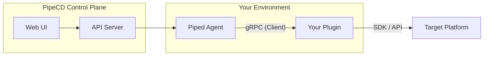

To build a plugin, you first need to understand how it fits into the PipeCD ecosystem.

## The gRPC Bridge

In PipeCD v1, the `piped` agent does not contain the logic for every possible deployment platform. Instead, it acts as an orchestrator. When a deployment starts, `piped` looks at the application configuration to see which plugin is responsible for the work.

`piped` then communicates with the plugin over **gRPC**.

### Key Responsibilities

| Component | Responsibility |
|-----------|----------------|
| **Piped** | Watches Git, triggers deployments, manages plugin lifecycles, and provides shared utilities (secret management, etc.). |
| **Plugin** | Implements specific logic for planning deployments, syncing resources, and calculating drift. |
| **SDK** | Simplifies gRPC implementation, provides log persistence, and abstracts common tasks. |

## Plugin Interfaces

The PipeCD Go SDK defines three main interfaces that a plugin can implement:

1. **Deployment**: Mandatory for any plugin that wants to execute stages. It handles planning and execution.
2. **LiveState**: Optional. Used to fetch the current state of resources from the live environment.
3. **Drift**: Optional. Used to compare the desired state (Git) with the live state.

In this book, we will focus on the **Deployment** interface.

## Lifecycle of a Plugin

1. **Startup**: `piped` starts the plugin binary as a sidecar or managed process.
2. **Registration**: The plugin starts a gRPC server and listens on a port.
3. **Handshake**: `piped` connects to the plugin and verifies compatibility.
4. **Execution**: When a deployment reaches a relevant stage, `piped` calls `ExecuteStage` on the plugin.
5. **Logging**: The plugin sends logs back to `piped` in real-time via the SDK.
