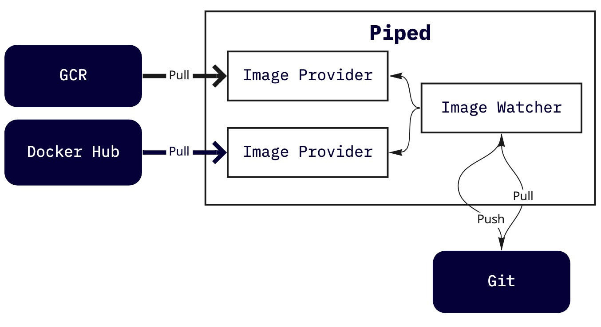

- Start Date: 2020-11-18
- Target Version: 1.0.0

# Summary
This RFC proposes adding a new feature to trigger Deployment when an image tag stored at a container registry is updated.
Similar to Flux's [Image Scan](https://docs.fluxcd.io/en/1.19.0/faq/#how-often-does-flux-check-for-new-images).

# Motivation
The canonical deployment flow with PipeCD is:

1. CI server pushes the generated image to the container registry after app-repo updated.
2. User updates the config-repo manually.

It is the User's responsibility to automate these steps to be done in a series of actions, while it is quite a bit of painful.
Therefore, we would like to solve this problem by letting Piped monitor the container registry.

# Detailed design
Piped periodically compares the image tags defined in git with the latest tags stored in the container registry, and then pushes them to git if there are any deviations.

### Usage
Note: Where, we call the client that accesses the container registry to `Image Provider`.

First of all, the using image provider must be specified in the piped configuration.

```yaml
apiVersion: pipecd.dev/v1beta1
kind: Piped
spec:
  imageProviders:
    - name: my-dockerhub
      type: DOCKERHUB
      # Indicates how many minutes Piped polls every.
      interval: 5m
      config:
        username: foo
        passwordFile: /etc/piped-secret/dockerhub-pass
```

Adding a file at `.pipe/` directory to define what image should be watched and what file should be updated:
```yaml
apiVersion: pipecd.dev/v1beta1
kind: ImageWatcher
spec:
  targets:
    - image: gcr.io/pipecd/foo
      provider: my-gcr
      filePath: foo/deployment.yaml
      field: spec.containers[0].image
    - image: pipecd/bar
      provider: my-dockerhub
      filePath: bar/deployment.yaml
      field: spec.containers[0].image
```

### Architecture
`Image Provider` pulls respectively periodically.
`Image Watcher` pulls from the git repo, compares respectively and pushes the one with differences.




# Alternatives
Initialy, We were thinking it should be defined in Deployment Configuration, but it's slightly different from configuration about Deployment.
In addition to that, it is too complicated to inspect the entire git path every time.

```yaml
apiVersion: pipecd.dev/v1beta1
kind: KubernetesApp
spec:
  imageWatcher:
    targets:
    - image: gcr.io/pipecd/helloworld
      path:
        filename: deployment.yaml
        field: spec.containers[0].image
      provider: my-dockerhub
```

# Unresolved questions

- How to update template. Currently considering using https://github.com/vmware-tanzu/carvel-ytt
- In the case that there are a bunch of repositories, is it really able to scale?
