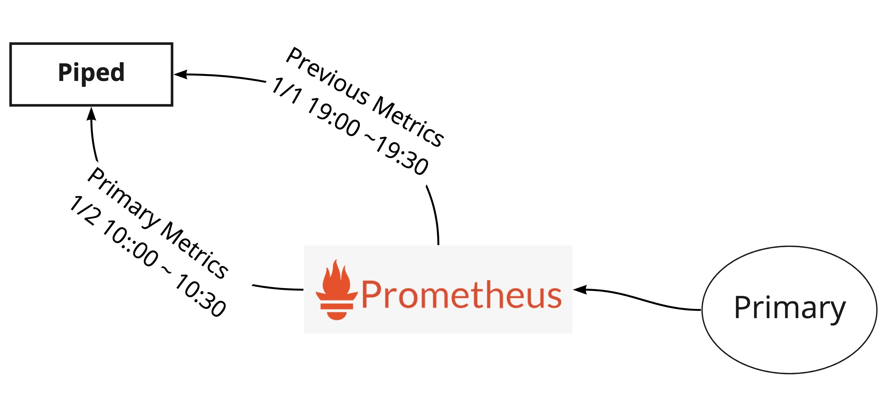

- Start Date: 2021-08-23
- Target Version: 0.16.0

# Summary
This RFC proposes supporting a new approach of Automated Deployment Analysis using dynamic data.

# Motivation
The current version of ADA supports only the solution based on static rules.
However, it is a bit tough to use when those thresholds change dynamically depending on the time of year or time of day.
Therefore, it's nice to analyze by comparing it with the metrics of currently running or from previous deployments, without specifying threshold.

# Detailed design
This proposal only focuses on analysis by metrics. We can think analysises by others like logs, https separately because we use different configuration fields for them.
This section covers what to compare and how to compare them.

## What to compare
There are two types of strategies:
- Canary Analysis
- Previous Analysis

### Canary Analysis

In Canary Analysis, it compares Canary and Baseline (or Primary if Baseline isn't launched).
The user needs to prepare a query for Canary and a query for Baseline.
For how to generate the queries, we discuss later.


NOTE: Although we can compare Canary with Primary, we recommend comparing with Baseline. We have to mention that on our documentation.

### Previous Analysis

In Previous Analysis, it compares the metrics of the previous Primary deployment with the metrics of the current Primary.
This is quite useful if you can't prepare the Canary variant for some reasons.
To do that, it needs to save the start time of the ANALYSIS stage. It fetches the previous metrics using it.



For those whose monitoring system's retension is short, in the future, it's good to store metrics during the the previous analysis in Filestore.

## How to compare
PipeCD uses [Mann–Whitney U test](https://en.wikipedia.org/wiki/Mann%E2%80%93Whitney_U_test), a nonparametric statistical test to check for a significant difference between the metrics.
For each interval, it computes the score and ends with failure immediately if the result was out of the marginal range.

### How to implement Mann–Whitney U test

We can implement it in Go based on [the Kayenta implementation](https://github.com/spinnaker/kayenta/blob/master/kayenta-judge/src/main/scala/com/netflix/kayenta/judge/classifiers/metric/MannWhitneyClassifier.scala#L33-L55) because that algorithm is relatevely simple.
[Kayenta](https://github.com/spinnaker/kayenta) is an independent component of Spinnaker. But it requires JVM and Redis to run.
If we embed Kayenta into Piped image, the image size will become larger. And we want to keep Piped run as a stateless component instead of depending on any external database like Redis.

## Strategies
From this version, we look to add four strategies.

- `THRESHOLD`: The static analysis strategy that we have used so far.
- `PREVIOUS`: The newly added strategy that compares the current version of Primary and the previous Primary.
- `CANARY_BASELINE`: The newly added strategy that compares the running Canary variant and the Baseline variant.
- `CANARY_PRIMARY`(not recommended): The newly added strategy that compares the running Canary variant and the Primary variant.

`THRESHOLD` only checks if the query result falls within the statically specified range, whereas others compare the two collections of time-series data then check for deviation.
Therefore, the those configuration fields are slightly different each other.

## Configuration
The newly added configuration fields are the following. All are optional, so no breaking change happens for those who use static ADA already.

| Field | Type | Description | Required |
|-|-|-|-|
| strategy | string | The strategy name. One of `THRESHOLD` or `PREVIOUS` or `CANARY_BASELINE` or `CANARY_PRIMARY` is available. Defaults to `THRESHOLD`. | No |
| deviation | string | The stage fails on deviation in the specified direction. One of `LOW` or `HIGH` or `EITHER` is available. This can be used only for `PREVIOUS`, `CANARY_BASELINE` or `CANARY_PRIMARY`. Defaults to `EITHER`. | No |
| baselineArgs | map[string][string] | The custom arguments to be populated for the Baseline query. They can be reffered as `{{ .VariantArgs.xxx }}`. | No |
| canaryArgs | map[string][string] | The custom arguments to be populated for the Canary query. They can be reffered as `{{ .VariantArgs.xxx }}`. | No |
| primaryArgs | map[string][string] | The custom arguments to be populated for the Primary query. They can be reffered as `{{ .VariantArgs.xxx }}`. | No |

### Args
To generate queries for the specific variants, we offer the two types of args that are passed into a query, built-in and custom args.

**Built-in args**

One of the most useful built-in arg is `{{ .Variant.Name }}`. With it, we can easily distinguish variants like `foo{variant="{{ .Variant.Name }}"}`

In the future, we plan to add more built-in args like `{{ .Variant.K8s.PodName }}` and `{{ .Variant.K8s.ServiceName }}` and so on.

**Custom args**

Other than built-in args, we can set custom one. With `baselineArgs` and `canaryArgs` etc, we can feel free to set args, and they can be reffered as `{{ .VariantArgs }}`.
You can see the examples on the next section.

### Examples
This section shows some examples for each strategies.

**The `THRESHOLD` strategy:**

```yaml
apiVersion: pipecd.dev/v1beta1
kind: KubernetesApp
spec:
  pipeline:
    stages:
      - name: K8S_PRIMARY_ROLLOUT
      - name: ANALYSIS
        with:
          duration: 30m
          metrics:
            - provider: my-prometheus
              interval: 10m
              expected:
                max: 0.1
              query: rate(cpu_usage_total{app="foo"}[10m])
```

We can configure it as usual. No additional configuration needed.

Note that the `expected` field can be used only for this `THRESHOLD` strategy.

**The `PREVIOUS` strategy:**

```yaml
apiVersion: pipecd.dev/v1beta1
kind: KubernetesApp
spec:
  pipeline:
    stages:
      - name: K8S_PRIMARY_ROLLOUT
      - name: ANALYSIS
        with:
          duration: 30m
          metrics:
            - strategy: PREVIOUS
              provider: my-prometheus
              interval: 10m
              deviation: HIGH
              query: rate(cpu_usage_total{app="foo"}[10m])
```

**The `CANARY_BASELINE` strategy:**

`CANARY_PRIMARY` will look almost the same.

```yaml
apiVersion: pipecd.dev/v1beta1
kind: KubernetesApp
spec:
  pipeline:
    stages:
      - name: K8S_CANARY_ROLLOUT
        with:
          replicas: 20%
      - name: K8S_BASELINE_ROLLOUT
        with:
          replicas: 20%
      - name: ANALYSIS
        with:
          duration: 30m
          metrics:
            - strategy: CANARY_BASELINE
              provider: my-prometheus
              interval: 10m
              deviation: HIGH
              query: rate(cpu_usage_total{app="foo", variant="{{ .BuiltInArgs.Variant.Name }}"}[10m])
      - name: K8S_PRIMARY_ROLLOUT
      - name: K8S_CANARY_CLEAN
      - name: K8S_BASELINE_CLEAN
```

**The pattern of using custom args:**

You can reffer the defined custom args by using `{{ .VariantArgs.xxx }}`.

```yaml
      - name: ANALYSIS
        with:
          duration: 30m
          metrics:
            - strategy: CANARY_BASELINE
              provider: my-prometheus
              interval: 10m
              deviation: HIGH
              query: rate(cpu_usage_total{app="foo", bar="{{ .VariantArgs.bar }}"}[10m])
              baselineArgs:
                bar: 1
              canaryArgs: 
                bar: 2
```

**The pattern of using custom args in AnalysisTemplate:**

```yaml
apiVersion: pipecd.dev/v1beta1
kind: AnalysisTemplate
spec:
  metrics:
    http_error_rate:
      strategy: CANARY_BASELINE
      provider: my-prometheus
      interval: 10m
      deviation: HIGH
      query: |
        sum without(status) (rate(http_requests_total{status=~"5.*", job="{{ .AppArgs.Name }}", bar="{{ .VariantArgs.bar }}"}[10m]))
        /
        sum without(status) (rate(http_requests_total{job="{{ .AppArgs.Name }}, bar="{{ .VariantArgs.bar }}"}[10m]))
      baselineArgs:
        bar: baz
      canaryArgs:
        bar: quz
```

Originally, AnalysisTemplate was made for commonalizing ADA settings between applications. However this time, we're attempting to add a brand new template to commonalize ADA settings between variants.
In order to prevent users from being confused, we add new variable groups `{{ .BuiltInArgs }}`, `{{ .VariantArgs }}`, and `{{ .AppArgs }}` (former `{{ .App }}`).

# Unresolved questions
There are a couple of unresolved questions.

### About how to store previous deployment metrics
Is Filestore really the best place to store? No considerations on storing Users metrics in Control-plane?

(8/26 updates) For now we settled on not supporting to store metrics. In the future, we plan to do it for those whose monitoring system's retension is short.

### About query templating
Alternatively, if we provide just `{{ .Variant }}` variable like Harness CV, the ANALYSIS configuration may be more simple.
Users have to prepare just one query for each metric like:

```yaml
apiVersion: pipecd.dev/v1beta1
kind: KubernetesApp
spec:
  pipeline:
    stages:
      - name: ANALYSIS
        with:
          duration: 30m
          dynamic:
            metrics:
              - provider: prometheus-dev
                interval: 5m
                expected:
                  max: 0.1
                query: |
                  sum without(status) (rate(http_requests_total{status=~"5.*", job="foo", variant="{{ .Variant }}"}[10m]))
                  /
                  sum without(status) (rate(http_requests_total{job="foo", variant="{{ .Variant }}"}[10m]))
      - name: K8S_PRIMARY_ROLLOUT
```

However, we could lose a kind of flexibility. Users have to configure their monitoring system to have variant labels.
For example, for Prometheus, some kind of relabel_configs is needed like:

```yaml
      - job_name: kube-state-metrics
        kubernetes_sd_configs:
          - role: endpoints
        relabel_configs:
          - source_labels: [__meta_kubernetes_service_annotation_pipecd_dev_variant]
            action: keep
            regex: variant
```

(8/30 updates) we settled on offering both built-in args (like `{{ .Variant }}`) and custom args (like `{{ .Variant.CustomArgs }}`).

### About static ADA
Does it need to still have the static ADA feature?
If Previous Analysis goes well, it could be fine to make it deprecated because the Previous Analysis is a high level feature that wraps the static ADA.

(8/26 updates) static ADA is needed for some users who want to evaluate Canary but don't want to launch Baseline. The strategy `CanaryWithPrimary` sometimes makes wrong result due to the amount of traffic, etc.
