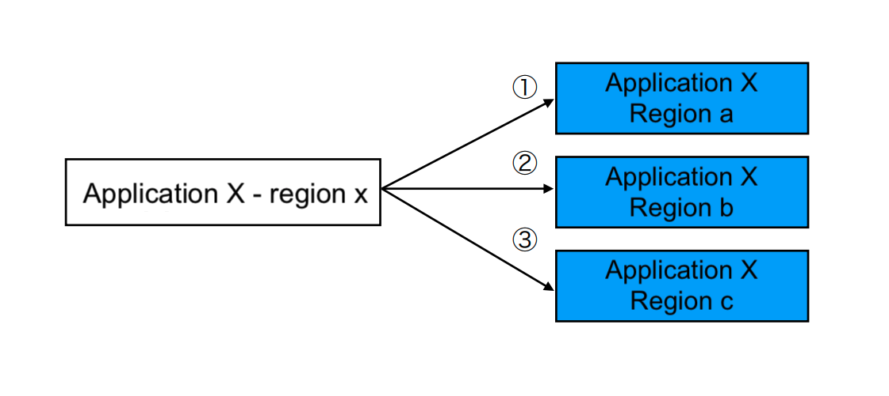

- Start Date: 2021-11-03
- Target Version: 0.22.0

# Summary
This RFC introduces a new way to enable users to connect multiple applications to a complex deployment pipeline. It can bring to users the ability to roll out to multiple clusters gradually or promote across environments.

# Motivation
With the current supporting deployment, our users have to define their application as one of the supporting application's kinds (K8s, Terraform, CloudRun, Lambda, ECS), they can still define multiple PipeCD applications as parts of their application and trigger them one by one, but it's a bit difficult for them to control the deployment chain smoothly.


Use-case <1>: chain of deployments contains multiple applications cross kinds

Another typical use-case is when users want to build up some kind of chain such as deploy application to the development environment, then if it's done successfully, deploy that application to the staging and then the production environment.


Use-case <2>: chain of deployments contains application deployed across multiple environments

Or a variant of that requirement, when users want to roll out their applications to their cluster one by one based on its region. As the same below image, the order of the rolling out deployment should be flex, supports both sequential and parallel.


Use-case <3>: chain of deployments contains application deployed across multiple regions

All the above requirements share the same thing in the context, that is: it can be done by users' deployment for their applications as PipeCD applications one by one and make trigger those deployments manually via console or make trigger via pull requests to those application configurations separately, but this all manual stub are tedious and difficult to manage smoothly. With this new __PipeCD deployment chain__ feature, all of those manual steps will be replaced, to keep the good point of using a CD system.

# Detailed design
The idea is to keep the PipeCD application deployment as a unit of deployment as is, but add __a way to enable users to manipulate a deployment chain based on the state of the last successfully run deployment__.

A canonical flow would look as below:
1. Users trigger to run their first application (the first application in their deployment chain) via the web console or pull requests as usual
2. Deploy the first triggered application in the deployment chain
3. In case the trigger for the first application in the deployment chain satisfied some conditions (such as containing configured commit message) the piped will send a trigger command to trigger the deployment chain to the control-plane, since all those applications are shared in the same project, this trigger should be valid
4. Control-plane gets deployment events triggered by the first application's piped and makes sync deployment commands for all listed applications
5. Pipeds which handle deployment for all triggered applications fetch sync command and deploy its application once the conditions are satisfied


## Configuration

At the step (3), to configure the deployment chain and trigger it via triggering the first applications (in the deployment chain), we introduce a new configuration section to the deployment configuration named `postSync` which contains configurations of actions that the in charge piped should do after the deployment triggered.

The configuration would look like:

```yaml
apiVersion: pipecd.dev/v1beta1
kind: Terraform
spec:
  input:
    ...
  pipeline:
    ...
  trigger:
    onOutOfSync:
      disable: true # default is `true`
    onCommand:
      disable: false # default is `false`
    onCommit:
      disable: false # default is `false`
      paths:
        - manifests/deployment.yaml
    onChain:
      disable: false # default is `false`
  postSync:
    chain:
      applications:
        - name: app2
          labels:
            - app: 2 # will match all app2-1, app2-2, app2-3 which share label (app: 2)
        - name: app3
          kind: Kubernetes
          labels:
            - app: 3 # will match all app which share label (app: 3)
      conditions:
        - commitPrefix: “xx”
        - ...
```

The newly added configuration fields as follow:

### postSync.chain

| Field | Type | Description | Required |
|-|-|-|-|
| applications | []Application | The list of applications which should be triggered once deployment of this application rolled out successfully. | Yes |
| conditions | []Condition | The list of conditions to control when would the in charge piped of this application should trigger deployment chain. | No |

### Application

A set of filters, use to decide which application (PipeCD application) should be triggered to deploy as part of the deployment chain. If multiple filters are set, manipulate those filters by `AND` operator.

| Field | Type | Description | Required |
|-|-|-|-|
| name | string | The name of PipeCD application, application name is not unique in PipeCD datastore | No |
| kind | string | One of PipeCD supporting application kinds (Kubernetes, ECS,...) | No |
| labels | []Label | The list of PipeCD application's labels | No |

### Condition

| Field | Type | Description | Required |
|-|-|-|-|
| commitPrefix | string | The prefix of the commit message that used to trigger running one deployment chain | Yes |

The above configuration will provide a deployment chain as follow


## More examples regards known use-cases

The above configuration contains sample for a completely flexsible deployment chain (multiple applications with difference kinds deployed across environment). For clarity, here are some examples for each known use-cases listed in [above section](#motivation)

### Use-case <1>: chain of deployments contains multiple applications cross kinds


In this examples, users create 3 applications which are: Infra (name: infra, kind: terraform), X (name: x, kind: cloudrun), Y (name: y, kind: kubernetes).

Application `Infra` (the first application of the chain) configuration:

```yaml
apiVersion: pipecd.dev/v1beta1
kind: TerraformApp
name: infra
spec:
  input:
    ...
  pipeline:
    ...
  postSync:
    chain:
      applications:
        - name: x
          kind: CloudrunApp
        - name: y
          kind: KubernetesApp
      conditions:
        - commitPrefix: “Trigger chain”
```

Application `x` configuration:
```yaml
apiVersion: pipecd.dev/v1beta1
kind: CloudrunApp
name: x
spec:
  pipeline:
    ...
```

Application `y` configuration:
```yaml
apiVersion: pipecd.dev/v1beta1
kind: KubernetesApp
name: y
spec:
  pipeline:
    ...
```

### Use-case <2>: chain of deployments contains application deployed across multiple environments


In this examples, users create 3 applications which are: X-1 (name: x, kind: kubernetes, env: dev), X-2 (name: x, kind: kubernetes, env: stag), X-3 (name: x, kind: kubernetes, env: prod).

Application `X-1` (the first application of the chain) configuration:
```yaml
apiVersion: pipecd.dev/v1beta1
kind: KubernetesApp
name: x
spec:
  pipeline:
    ...
  postSync:
    chain:
      applications:
        - name: x
          labels:
            - env: stag # need to add labels <env:stag> to application X-2 to separate it with others.
        - name: x
          labels:
            - env: prod # need to add labels <env:prod> to application X-3 to separate it with others.
      conditions:
        - commitPrefix: “Trigger chain”
```

Application `X-2` configuration:
```yaml
apiVersion: pipecd.dev/v1beta1
kind: KubernetesApp
name: x
labels:
  - env: stag
spec:
  pipeline:
    ...
```

Application `X-3` configuration:
```yaml
apiVersion: pipecd.dev/v1beta1
kind: KubernetesApp
name: x
labels:
  - env: prod
spec:
  pipeline:
    ...
```

### Use-case <3>: chain of deployments contains application deployed across multiple regions


In this examples, users create 4 applications which are: X-x (name: x, kind: kubernetes, region: region-x), X-a (name: x, kind: kubernetes, region: region-a), X-b (name: x, kind: kubernetes, region: region-b), X-c (name: x, kind: kubernetes, region: region-c)

Application `X-x` (the first application of the chain) configuration:
```yaml
apiVersion: pipecd.dev/v1beta1
kind: KubernetesApp
name: x
spec:
  pipeline:
    ...
  postSync:
    chain:
      applications:
        - name: x # since all required applications have the same name `x`
      conditions:
        - commitPrefix: “Trigger chain”
```

Applications `X-a`, `X-b`, `X-c` configuration:
```yaml
apiVersion: pipecd.dev/v1beta1
kind: KubernetesApp
name: x
spec:
  pipeline:
    ...
```

Note:
- All labels in the above examples are users' defined labels, not specified by PipeCD.
- In use-case <3>, the `X-x` application will be triggered first, and after it's deployed successfully, `X-a`, `X-b` and `X-c` will be triggered and rolling out at the same time (deployment run in parallel).

## Web view

For the next step, we will postpone the implementation for `deployment chain` page, everything around application and deployment are remained since the main thing that changed due to tasks for this feature are mainly on the server side. To make users have a more clear view to know which deployment is in deployment chain and which is just a single triggered lets add one more stage to the deployment plan of the first deployment in the chain


This stage will be added in the planning step by the piped in charge for the first deployment in chain. Piped will base on the `postSync.chain.conditions` to decide should add this stage or not.

For the next phase, we can add a new page called `deployment chain` which use the `postSync.chain.applications` and build up the view of the deployment chain for better visualization


With this approach, we can
- have a place where the can configure the deployment chain directly (the deployment configuration YAML of the first application in the chain), we can review it and manage it on Git as other current deployment configuration
- all pipeds that are in charge to deploy applications in the deployment chain only need to care about the deployment of its controlling applications, everything else will be triggered via sync command on the control-plane side, so no need to change anything about execution and no extra shared information across applications/piped's configuration is required
- separate a trigger that starts running a single deployment for a specified application with the trigger which starts a whole deployment chain (via the `postSync.chain.conditions` configuration)
- ensure only trigger deployment for an application in case conditions are satisfied: for those applications which depend on the first application of the chain, postSync only run when the application deployment run successfully, for those applications which in the chain, only when the depends on application marked as synced and there is a sync command for it on the control-plane (we may need to ensure synced implementation for all application kinds).
- we can postpone the implementation of the web UI for this deployment chain and address it later (when we have more resources for the console web view).

## Things to concern

In case the deployment chain is triggered, if applications in the chain require different commit-ish to deploy, if the commit that triggers deploy the first application of the deployment chain only contains all changes required to roll out a new version for the first application, how should we do to let piped in charge for other applications in the deployment chain know the commit-ish it should use to deploy its application?


This issue can be avoided by ensuring all changes required for all applications are provided in the same commit but it is tricky and hard for users to keep that way. Besides, if the applications' configurations are stored in separated repositories from start, the commit-ish for those changes are always different. We may need to require users to ensure all changes for applications will be provided in the same commit (in case of using single configuration repo) or make changes for each to be triggered application as the last commit of their configuration repository to avoid that issue.
