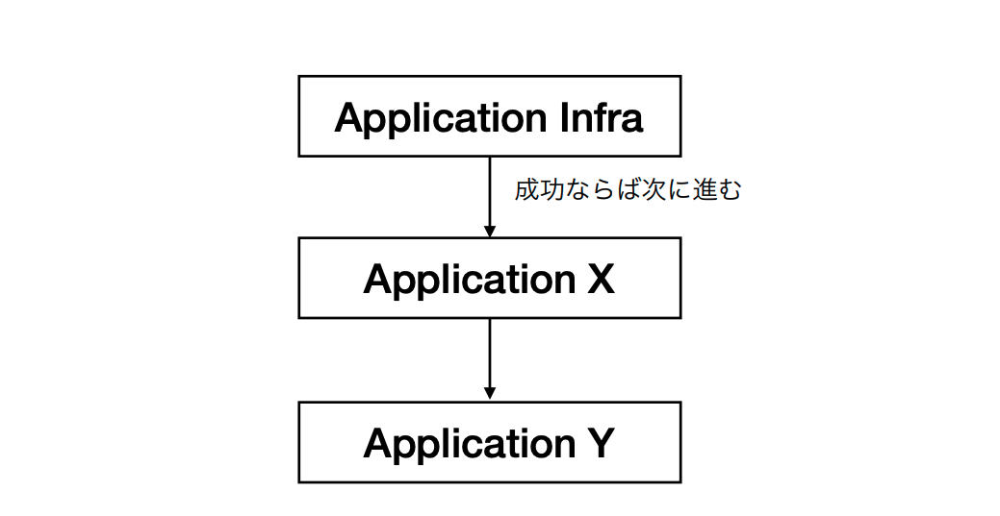
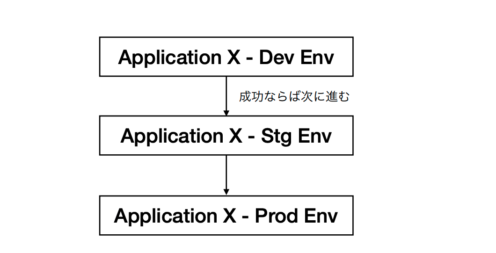
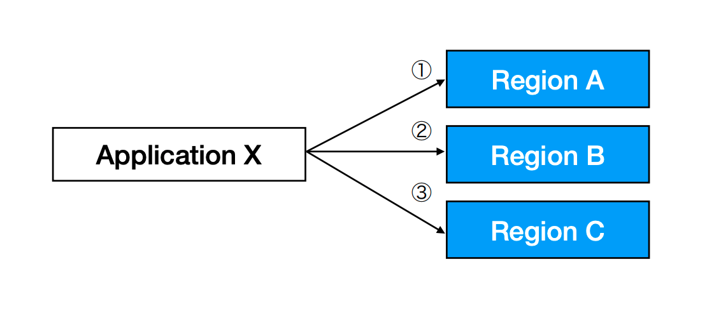
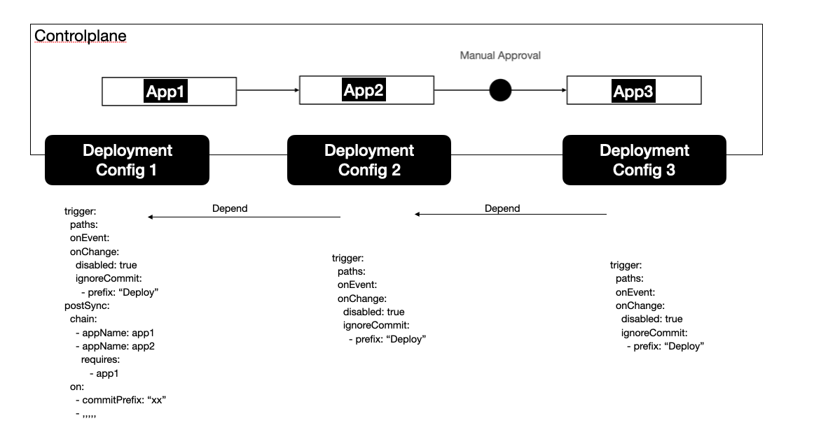

- Start Date: 2021-11-03
- Target Version: 0.22.0

# Summary
This RFC introduces a new way to enable users to deploy their complex system (or applications) in a more flexible way by manipulating the currently supporting application's deployment.

# Motivation
With the current supporting deployment, our users have to define their application as one of the supporting application's kinds (K8s, Terraform, CloudRun, Lambda, ECS), they can still define multiple PipeCD applications as parts of their application and trigger them one by one, but it's a bit difficult for them to control the deployment flow smoothly.



Another typical usecase is when users want to build up some kind of deployment flow such as deploy application to the development environment, then if it's done successfully, deploy that application to the staging and then the production environment.



Or a variant of that requirement, when users want to roll out their applications to their cluster one by one based on its region. As the same below image, the order of the rolling out deployment should be flex, supports both sequential and parallel.



All the above requirements share the same thing in the context, that is: it can be done by users' deployment for their applications as PipeCD applications one by one and make trigger those deployments manually via console or make trigger via pull requests to those application configurations separately, but this all manual stub are tedious and difficult to manage smoothly. With this new PipeCD deployment flow feature, all of those manual steps will be replaced, to keep the good point of using a CD system.

# Detailed design
The idea is to keep the PipeCD application deployment as a unit of deployment as is, but add __a way to enable users to manipulate a deployment flow based on the state of the last sucessfully run deployment__.

A canonical flow would look as below:
- Users trigger to run their first application (the first application in their deployment flow) via the web console or pull requests as usual (1)
- Deploy the first triggered application in the deployment flow (2)
- After the application is deployed successfully, the piped will send a trigger command to trigger the deployment flow to the control-plane, since all those applications are shared in the same project, this trigger should be valid (3)
- Control-plane gets deployment events triggered by the first application's piped and makes sync deployment commands for all listed applications (4)
- Pipeds which handle deployment for all triggered applications fetch sync command and deploy its application once the conditions are satisfied (5)



## Configuration

At the step (3), to enable configure the deployment flow after the first applications (in the deployment flow) deployed successfully, we introduce a new configuration section to the deployment configuration named `postSync` which contains configurations of actions that the in charge piped should do after the deployment run successfully.

The configuration would look like:

```yaml
apiVersion: pipecd.dev/v1beta1
kind: KubernetesApp
spec:
  input:
    ...
  pipeline:
    ...
  trigger:
    paths:  
    onEvent:
    onChange:
    onFlow:
      disable: false
  postSync:
    flow:
      graph:
        - appName: lambda1
          requireApproval: true # add wait approval stage to the lambda 1 deployment pipeline on planning 
        - appName: lambda2
          depends:
            - lambda1
      conditions:
        - commitPrefix: “xx”
        - ...
```

The newly added configuration fields as follow:

### postSync.flow

| Field | Type | Description | Required |
|-|-|-|-|
| graph | []GraphNode | The list of applications which should be triggered once deployment of this application rolled out successfully. | Yes |
| conditions | []Condition | The list of conditions to control when would the in charge piped of this application should trigger deployment flow. | No |

### GraphNode

| Field | Type | Description | Required |
|-|-|-|-|
| appName | string | The name of application that should be triggered once the current application deployment applied successfully | Yes |
| depends | []string | The list of applications' names that the triggered application depends on. In case it contains nothing, the triggered application will be treated as able to be rollout in parallel | No |
| requireApproval | bool | (Considering) If this value is set to true, triggered application will be forced to contain a manual approve stage (Will add that stage on planning deployment for the triggered application) | No |

### Condition

| Field | Type | Description | Required |
|-|-|-|-|
| commitPrefix | string | The prefix of the commit message that used to trigger running one deployment flow | Yes |

## Web view

For the next step, we will postpone the implementation for `deployment flow` page, everything around application and deployment are remained since the main thing that changed due to tasks for this feature are mainly on the server side. To make users have a more clear view to know which deployment is in deployment flow and which is just a single triggered lets add one more stage to the deployment plan of the first deployment in the flow


This stage will be added in the planning step by the piped in charge for the first deployment in flow. Piped will base on the `postSync.flow.conditions` to decide should add this stage or not.

With this approach, we can
- have a place where the can configure the deployment flow directly (the deployment configuration YAML of the first application in the flow), we can review it and manage it on Git as other current deployment configuration
- all pipeds that are in charge to deploy applications in the deployment flow only need to care about the deployment of its controlling applications, everything else will be triggered via sync command on the control-plane side, so no need to change anything about execution and no extra shared information across applications/piped's configuration is required
- separate a trigger that starts running a single deployment for a specified application with the trigger which starts a whole deployment flow (via the `postSync.flow.conditions` configuration)
- ensure only trigger deployment for an application in case conditions are satisfied: for those applications which depend on the first application of the flow, postSync only run when the application deployment run successfully, for those applications which in the flow, only when the depends on application marked as synced and there is a sync command for it on the control-plane (we may need to ensure synced implementation for all application kinds).
- we can postpone the implementation of the web UI for this deployment flow and address it later (when we have more resources for the console web view).

## Things to concern

In case the deployment flow is triggered, if applications in the flow require different commit-ish to deploy, if the commit that triggers deploy the first application of the deployment flow only contains all changes required to roll out a new version for the first application, how should we do to let piped in charge for other applications in the deployment flow know the commit-ish it should use to deploy its application?


This issue can be avoided by ensuring all changes required for all applications are provided in the same commit but it is tricky and hard for users to keep that way. Besides, if the applications' configurations are stored in separated repositories from start, the commit-ish for those changes are always different.
