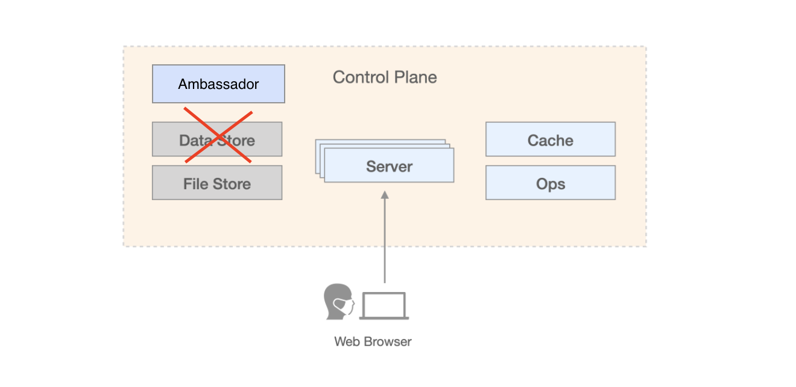
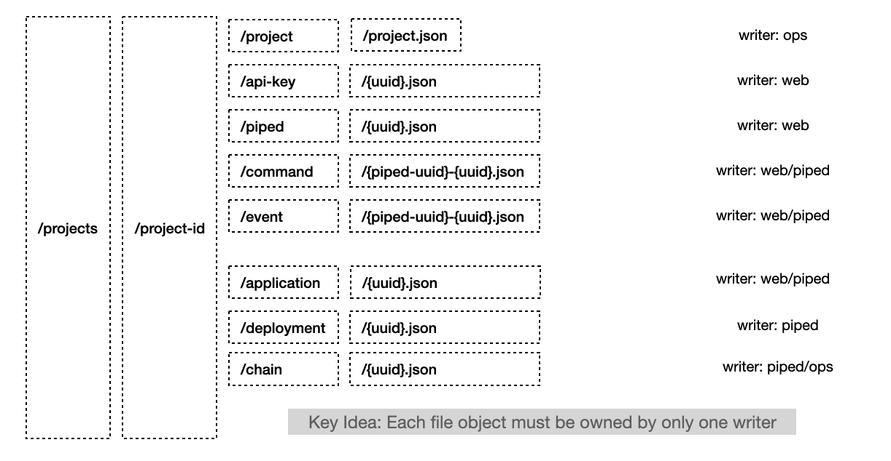
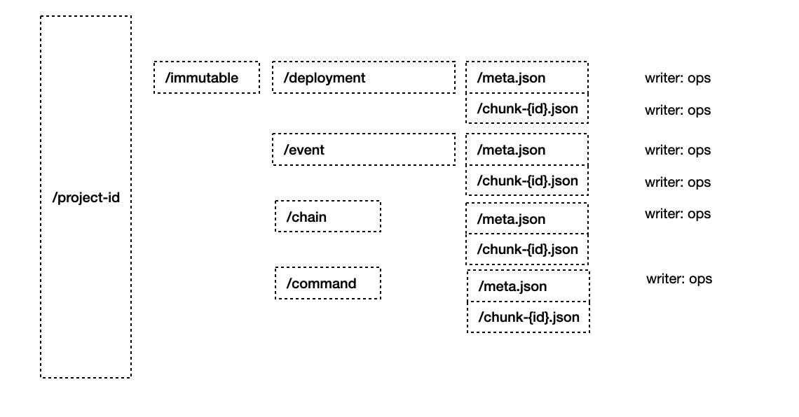
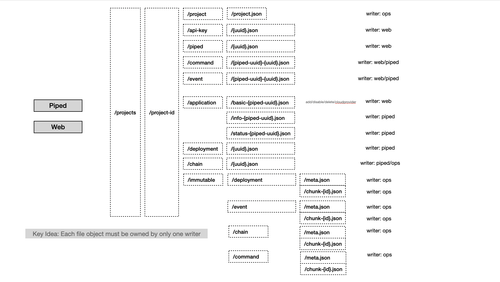

- Start Date: 2021-12-19
- Target Version: 0.24.0
- **Status: DEPRECATED** (Discontinued as of v0.XX.Y)

# Summary

> **⚠️ DEPRECATED NOTICE:** This RFC describes the FileDB feature which has been **discontinued** as of PipeCD v0.XX.Y. The implementation was removed due to maintenance complexity and reliability concerns. PipeCD now exclusively supports **Firestore** and **MySQL** as datastore backends.

This RFC introduces a way to host your own PipeCD control-plane without datastore. Refer to the PipeCD [control-plane architecture overview](https://pipecd.dev/docs/operator-manual/control-plane/architecture-overview/) for more information about what is PipeCD datastore.

# Motivation

As mentioned in the PipeCD [control-plane architecture overview](https://pipecd.dev/docs/operator-manual/control-plane/architecture-overview/), PipeCD control-plane is the place where to store states for all deployment agents (we called it Piped), and other model objects to control PipeCD business logic. All of those objects are stored by `Data Store` which is a fully-managed service such as GCP Firestore, GCP CloudSQL, AWS RDS(or Aurora) as recommended, or a self-hosted MySQL database instance (as we do in [quickstart example](https://pipecd.dev/docs/quickstart/)). The problem with the current implementation is even we can use the external managed service as a datastore and can easily configure that way, we still need to configure/prepare for that component. PipeCD team wants to reduce as much extra setup as possible to make PipeCD simpler and easier to get started with. In this RFC, we share an idea about archiving the above requirement, that is: using the filestore component for both stage logs and model objects storing. This idea is possible because the models of PipeCD are designed in a way where we can store objects as is and just update the object itself, do not need to join or use complicated database features.

# Detailed design

As mentioned above, the current implementation of PipeCD allows us to just store objects as is, and from the reading side, we do not use complicated queries with `join` or something like that, which means we can simply write data objects to files directly. The remaining problems are:
1. How to ensure the correctness to avoid data corruption, data loss, inconsistency from being handled by concurrent processes.
2. How should we index/store the data objects so that we can read stored data fast enough to not make our users anger because of the slow response console.

## To handle (1) we have two approaches:
- Achieve by implement __lock__
- Achieve by avoid concurrent processes data as much as possible

### Achieve by implement lock

The most important thing to keep in mind while implement lock is to ensure there is always only ONE lock for each data object, and there will be only ONE process, which can hold the lock.
With that note to keep in mind, we may have some approaches to go this way:
- Create a single ambassador for write <1>
- Using external service which controls locks (pessimistic locking) <2>
- Using version field as data object properties and check for the version before write (optimistic locking) <3>

#### <1> Create a single ambassador for write

Use a single process to handling lock, we can achieve that by introducing a new PipeCD component which only handle data writing. This new component works as a proxy for the current datastore component, and we have to keep it always be singleton.

Cons:

    - Downtime due to single point of failure.
    - Performance on writing since there is only one writer which handles all PipeCD components write operations.
    - Have one more component which we need to handle ourself.

#### <2> Using external service which controls locks (pessimistic locking)

Use an external service or Cache (the current Cache component) to store lock for all objects. Whenever we need to write (create or update) objects, add one more step to ask the lock controlling service to get a lock for the object.
This approach is known as pessimistic locking.

Pros:

    - PipeCD's objects have unique id which can be used as the key for lock in Cache or external service easily.
    - Already have a Cache component as a part of the control-plane, so we don't need to increase the number of components.

Cons:

    - Rely on an external system that holds the lock for all actors.
      Even in case we just use the current Cache component, it's designed to be faultable, it can be down but not affect the whole system.
      Making it controls locks means the Cache is a must and becomes a high availability component -> increase the cost of operating.
    - In some cases, when the lock isn't released successfully, such as owner/writer faulted before free the lock on objects, we have to implement timeout or such -> increase the complexity and maintain cost to the system.

#### <3> Using version field as data object properties (optimistic locking)

Use a version field in record to ensure that correct version was used before writing.

Pros:

    - Simple to implement since we only need to verify the version whenever we need to write.

Cons:

    - Depends on which file store being used, the filestore has to support sync state between regions/environment. Currently, only GCS is supporting features to implement this.

### Achieve by avoid concurrent processes data as much as possible

The idea is to split data to ensure that each file is only owned by one writer

Pros:

    - Simple to implement, since PipeCD data model is simple, we prepared for single writer already.

Cons:

    - Must keep a single writer for each object (or file in case we separate object to multiple files) and narrow down the number of possible features we can do.

This is the most possible way to implement currently. 👌

## To handle (2), there are some things we have to be aware of
- Filter option interface <1>
- Query bulk (fetch list) and query by id (fetch single object) <2>
- Read complex object which required to fetch multiple files then build up before return <3>

#### <1> Filter option interface

To unify with other datastore which be supported as PipeCD datastore (GCP firestore and MySQL), we plan to keep the ListOptions interface. Besides, this change should only affect the datastore layer, and we can change the application/API layer a bit to adopt this filestore database, but should not be too much. With this kind of requirement, we will have to add logic to the filestore database, which will fetch all objects in pagination and then filter by the conditions requested by clients (pipectl or web or piped). This may affect the performance and API latency compared to the database used pattern, but we can reduce the affection by using Cache.

#### <2> Query bulk (fetch list) and quere by id (fetch single object)

Since we will use filestore as PipeCD database, we should implement filestore with hot & cold storage separated pattern - storage called hot or cold defined based on: How often do the objects be updated? or the update frequency.

Objects such as: deployment, command, event, deployment-chain, etc are only be created once and once they finished their life time (state or status changed to SUCCESS|FAILURE|CANCELLED), they will no more be updated. Those kinds of objects should be stored in `chunk` and mostly will be used to shown as list from deployment list view, for example.

On the opposite side, objects like piped, project, application, etc have fewer numbers and are updated frequently throughout their lifetime; they should therefore be stored in hot storage.

To implement this hot & cold storage pattern, we will
- Introduce another storage controller to the ops. It will intervaly fetch file objects from hot storage, migrate objects to the cold storage in some conditions (based on objects state and timestamp)
- Make data objects in cold storage stored in 2 different ways for 2 different purposes
    + In chunk: used when request to get a list of objects (fetch bulk)
    + In individual files: just like we stored in the hot storage, used when request to get object by id (fetch single object)

#### <3> Read complex object which required to fetch multiple files then build up before return

For objects of `applications` model, we may need to treat them a bit differently from others. The object of applications model contains properties with different updating rates, for instance

- The applicationId, projectId, piped (which handle this application), kind are only be touched when creating object, mostly not been changed throughout object's lifetime. They should be counted as application basic info.
- The application name, labels, and source repository are updated a little more often, but not too much. They should be counted as application info, users likely change those properties manually while using PipeCD.
- The applications deploying status, sync state, most recently triggered/deployed deployment references, etc are the most frequently updated, they will be updated by piped which handles this application any time based on the events while deploying this application's deployments.

To store object for applications model, we plan to split it to 3 parts based on its updating rates. As a consequence, when we need to read objects of applications model, we need to fetch its 3 parts and build up in the datastore layer before return.

With the above splitting application models idea implemented, we will have the file structure for the hot storage looks like this.

# Things to concern

We have to keep in mind to avoid complex objects which possible be updated by multiple writers, which limits the number of possibilities we can choose when designing the feature.

Another thing to concern is when we face a case that requires reading a list of objects from the hot storage, and the number of objects is big enough, the API latency may get too high. Need to investigate the limitation for network filestore read/write.
