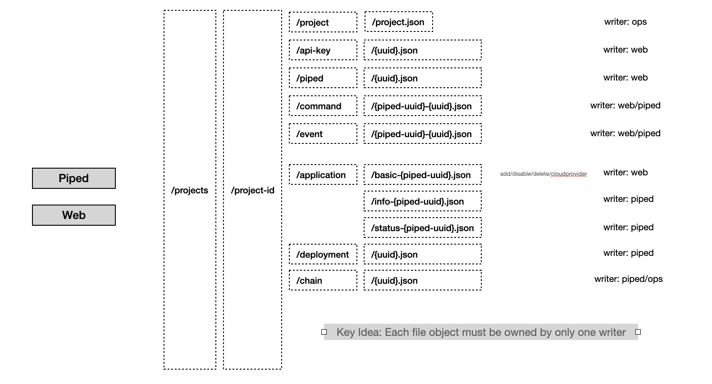

- Start Date: 2021-12-19
- Target Version: 0.24.0

# Summary

This RFC introduces a way to host your own PipeCD control-plane without datastore. Refer to the PipeCD [control-plane architecture overview](https://pipecd.dev/docs/operator-manual/control-plane/architecture-overview/) for more information about what is PipeCD datastore.

# Motivation

As mentioned in the PipeCD [control-plane architecture overview](https://pipecd.dev/docs/operator-manual/control-plane/architecture-overview/), PipeCD control-plane is the place where to store states for all deployment agents (we called it Piped), and other model objects to control PipeCD business logic. All of those objects are stored by `Datastore` which is a fully-managed service such as GCP Firestore, GCP CloudSQL, AWS RDS(or Aurora) as recommended or a self hosted MySQL database instance (as we do in [quickstart example](https://pipecd.dev/docs/quickstart/)). The problem with the current implementation is even we can use the external managed service as a datastore and can easily configure that way, we still need to configure/prepare for that component. PipeCD team wants to reduce as much extra setup as possible to make PipeCD simpler and easier to get started with. In this RFC, we share an idea about archiving the above requirement, that is: using the filestore component for both stage logs and model objects storing. This idea is possible because the models of PipeCD are designed in a way where we can store objects as is and just update the object itself, do need to join or use complicated database features.

# Detailed design

As mentioned above, the current implementation of PipeCD allows us to just store objects as is, and from the reading side, we do not use complicated queries with `join` or something like that, which means we can simply write data objects to files directly. The remaining problems are:
- How should we implement lock effectively in case we need to update the stored data objects
- How should we index/store the data objects so that we can read stored data fast enough to not make our users anger because of the slow response console.

### Some approaches we can take a look

1. Single ambassador for write (e.g. using ops for handling all write operations)

Issues:

    - Downtime due to single point of failure
    - Performance on get since there is only one reader

2. Distributed locking (optimistic)

Issues:

    - Use a version field in record to ensure that correct version was used before writing
    - Depends on which file store being used

3. Distributed locking (pessimistic)

Issues:

    - Rely on an external system that holds the lock for all actors
    - The key owner doesn't release, owner dies, timeout causes race condition

4. Split data to ensure that each file is only owned by one writer

Issues:

    - Must keep a single writer for each object (or file in case we separate object to multiple files) and narrow down the number of possible features we can do

### Making file stores object directly and keep single writter for each object file approach.

# Things to concern

In some cases, when we have objects that is be able to be updated by multiple "writers", it's hard to control the write ordering between those writers. Or else, we have to keep in mind to avoid complex objects which possible be updated by multiple writers, which limits the number of possibilities we can choose when designing the feature.
