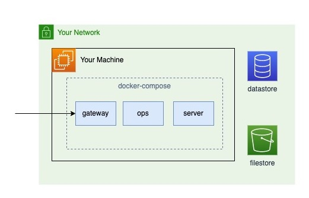
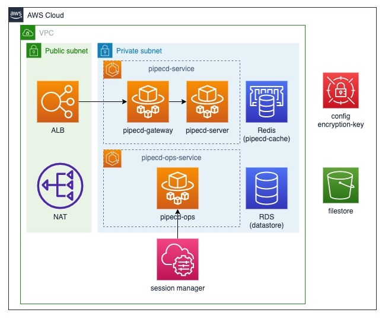

- Start Date: 2022-01-18
- Target Version: 0.41.3

# Summary

Support install PipeCD control plane on other platform which is not k8s

# Motivation

Currently, we can deploy the control plane to Kubernetes cluster, but some developers that would like to introduce PipeCD can not prepare Kubernetes environments. Hence we want to support installing PipeCD control plane on platforms other than Kubernetes.

# Detailed design

## 1. Control Plane on docker-compose
    ### Note:
    - Developers can deploy the control plane on a single machine.
    - Developers do not have to prepare a datastore and a filestore by themselves or they can easily use a database or a filestore on local machine.
    ### Production Architecture
    - Port-forward from docker-compose to your machine to enable external client access to pipecd-gateway container.
    
    
    
## 2. Control Plane on managed container services (ex. ECS)
    ### Note:
    - PipeCD gives the abstract architecture for ECS.
        - Give a [sample repository](https://github.com/pipe-cd/control-plane-aws-ecs-terraform-demo) that describes an architecture by using Terraform. 
        - The architectures are different by each project, so create your best architecture with refering to this repository and docker-compose file.
    - They can easily use the managed database or storage system on cloud as datastore and filestore.
    
    ### Production Architecture on ECS
    
    
    Note:
    - Devide a pipecd-server and a pipecd-ops to different services because they have the same port and have different authorization.
    - Pay attention to brocking public access to S3.
        - Add IAM role to ECS to access S3.
    - Make two types of target groups for both HTTP and gRPC. Use HTTPS for ALB listeners because gRPC listeners need HTTPS.
    - Set up before containers start to run so that PipeCD can use config files and encryption keys. You can choose from 3 options as below.
        - Use Secrets Manager as config store.
        ```
        # get configuration files from private S3 bucket via aws-cli
        echo $CONTROL_PLANE_CONFIG >> control_plane_config.yaml
        # replace datastore endpoint (if you use terraform, you can replace by using variables)
        sed -i -e s/pipecd-mysql/${var.db_instance_address}/ control-plane-config.yaml
        # You must set an encryption key to the environment value
        echo $ENCRYPTION_KEY >> encryption-key
        # replace cache endpoint (if you use terraform, you can replace by using variables)
        pipecd server \
        --insecure-cookie=true \
        --cache-address=${var.redis_host}:6379 \
        --config-file=control-plane-config.yaml \
        --enable-grpc-reflection=false \
        --encryption-key-file=encryption-key \
        --log-encoding=humanize --metrics=true;
        ```
        - Use Parameter Store as config store (Attention: Envoy config has over 4096 characters, so you can not use Parameter Store as envoy config file store.)
        - Use S3 as config store. (Attention: install aws-cli to the pipecd-server container to get configuration files from private s3 bucket)
        ```
        # get configuration files from private S3 bucket via aws-cli
        apk add aws-cli
        aws s3 cp s3://namba-pipecd-control-plane-config/control-plane-config.yaml ./
        ```

# Alternatives

Control Plane without container image
    - This alternative supports deploying the control plane as a binary such as piped.
    - It is stressful for developers to set up networking by themselves.

2. Abolish envoy and use ALB instead of envoy for access distribution
    - We must move the configuration for envoy to ALB.
    - We must make the same number of target groups as pipecd-server has.
