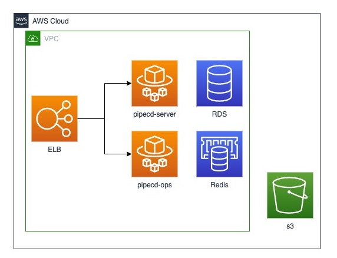
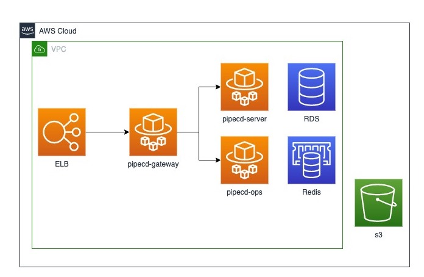

- Start Date: 2022-01-18
- Target Version: 0.41.3

# Summary

Support install PipeCD control plane on other platform which is not k8s

# Motivation

Now we can deploy the control plane to kubernetes cluster, but some developers that would like to introduce PipeCD can not prepare kubernetes environments. We want to support  install PipeCD control plane on platforms other than kubernetes.

# Detailed design

1. Control Plane on docker-compose
    - Developers can deploy control plane on a single machine.
    - Developers do not have to prepare datastore and filestore by themselves or they can easily use database or filestore on local machine.
    
2. Control Plane on managed container services (ex. ECS, Cloud Run)
    - Pipecd can give the way to deploy control plane as Terraform template.
    - They can easily use managed database or storage system on cloud as datastore and filestore.
    - They can use either self-hosted envoy or managed Load Balancer as pipecd-gateway.
    
    

# Alternatives

1. Control Plane without container image
    - This alternative supports deploy control plane as a binary such as Piped
    - It is stressful for developers to set up networking by themselves

# Unresolved questions

None