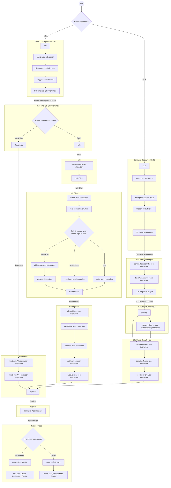

- Start Date: 2023-11-24
- Target Version: 1.45.1

# Summary

To simplify the creation of a configuration file using the pipectrl init command.

# Motivation

Easily accept new users by making it easy to adopt pipecd when using it for the first time.  
Also, build in the ability to easily migrate from the configuration files of users using other CD tools to PipeCD.

# Detailed design

pipectrl init command will be added to the pipecdctl command.
The pipectrl init command will have 3 features.

1. Create a configuration file from scratch
2. Create a configuration file from an existing configuration file
3. Create a configuration file from an existing configuration file of another CD tool

I think it would be better to split the Release by feature.

## 1. Create a configuration file from scratch

This feature creates a configuration file by allowing the user to interactively enter information.
It is supposed to set only the minimum required setting values.
Users are expected to add complex settings themselves.
Even the minimum necessary values can be used to try out the system at hand, and the skeleton reduces the time and effort required for subsequent setups.

### Setting values

https://pipecd.dev/docs-v0.45.x/user-guide/configuration-reference/
Think about the necessary settings from the above

#### Target Application
Kubernetes Application

#### Supported setting values

The definition of init type is as follows

- interactive
  - user input
- default value
  - Set default value
- omit
  - Do not add in init

| init type | setting value | Field | Type | Description | Required |
| -- | -- | -- | -- | -- | -- |
| interactive | free-text entry | name | string | The application name. | Yes (if you want to create PipeCD application through the application configuration file) |
| omit | none | labels | map[string]string | Additional attributes to identify applications. | No |
| default value | init application | description | string | Notes on the Application. | No |
| refs KubernetesDeploymentInput |   | input | https://pipecd.dev/docs-v0.45.x/user-guide/configuration-reference/#kubernetesdeploymentinput | Input for Kubernetes deployment such as kubectl version, helm version, manifests filter… | No |
| default value | onCommit | trigger | https://pipecd.dev/docs-v0.45.x/user-guide/configuration-reference/#deploymenttrigger | Configuration for trigger used to determine should we trigger a new deployment or not. | No |
| omit | none | planner | https://pipecd.dev/docs-v0.45.x/user-guide/configuration-reference/#deploymentplanner | Configuration for planner used while planning deployment. | No |
| omit | none | commitMatcher | https://pipecd.dev/docs-v0.45.x/user-guide/configuration-reference/#commitmatcher | Forcibly use QuickSync or Pipeline when commit message matched the specified pattern. | No |
| omit | none | quickSync | https://pipecd.dev/docs-v0.45.x/user-guide/configuration-reference/#kubernetesquicksync | Configuration for quick sync. | No |
| refs Pipeline |   | pipeline | https://pipecd.dev/docs-v0.45.x/user-guide/configuration-reference/#pipeline | Pipeline for deploying progressively. | No |
| omit | none | service | https://pipecd.dev/docs-v0.45.x/user-guide/configuration-reference/#kubernetesservice | Which Kubernetes resource should be considered as the Service of application. Empty means the first Service resource will be used. | No |
| omit | none | workloads | []https://pipecd.dev/docs-v0.45.x/user-guide/configuration-reference/#kubernetesworkload | Which Kubernetes resources should be considered as the Workloads of application. Empty means all Deployment resources. | No |
| omit | none | trafficRouting | https://pipecd.dev/docs-v0.45.x/user-guide/configuration-reference/#kubernetestrafficrouting | How to change traffic routing percentages. | No |
| omit | none | encryption | https://pipecd.dev/docs-v0.45.x/user-guide/configuration-reference/#secretencryption | List of encrypted secrets and targets that should be decrypted before using. | No |
| omit | none | attachment | https://pipecd.dev/docs-v0.45.x/user-guide/configuration-reference/#attachment | List of attachment sources and targets that should be attached to manifests before using. | No |
| omit | none | timeout | duration | The maximum length of time to execute deployment before giving up. Default is 6h. | No |
| omit | none | notification | https://pipecd.dev/docs-v0.45.x/user-guide/configuration-reference/#deploymentnotification | Additional configuration used while sending notification to external services. | No |
| omit | none | postSync | https://pipecd.dev/docs-v0.45.x/user-guide/configuration-reference/#postsync | Additional configuration used as extra actions once the deployment is triggered. | No |
| omit | none | variantLabel | https://pipecd.dev/docs-v0.45.x/user-guide/configuration-reference/#kubernetesvariantlabel | The label will be configured to variant manifests used to distinguish them. | No |
| omit | none | eventWatcher | []https://pipecd.dev/docs-v0.45.x/user-guide/configuration-reference/#eventwatcher | List of configurations for event watcher. | No |
| omit | none | driftDetection | https://pipecd.dev/docs-v0.45.x/user-guide/configuration-reference/#driftdetection | Configuration for drift detection. | No |

KubernetesDeploymentInput

| init type | setting value | Field | Type | Description | Required |
| -- | -- | -- | -- | -- | -- |
| omit | none | manifests | []string | List of manifest files in the application directory used to deploy. Empty means all manifest files in the directory will be used. | No |
| omit | none | kubectlVersion | string | Version of kubectl will be used. Empty means the version set on piped config or default version will be used. | No |
| interactive | user selects kustomize or helm Free text only if user selects kustomize | kustomizeVersion | string | Version of kustomize will be used. Empty means the default version will be used. | No |
| interactive | user selects kustomize or helm Free text only if user selects kustomize | kustomizeOptions | map[string]string | List of options that should be used by Kustomize commands. | No |
| interactive | user selects kustomize or helm Free text only if user selects kustomize | helmVersion | string | Version of helm will be used. Empty means the default version will be used. | No |
| interactive | user selects kustomize or helm refs HelmChart only if user select helm | helmChart | HelmChart | Where to fetch helm chart. | No |
| interactive | user selects kustomize or helm refs HelmOptions only if user select helm | helmOptions | HelmOptions | Configurable parameters for helm commands. | No |
| omit | none | namespace | string | The namespace where manifests will be applied. | No |
| omit | none | autoRollback | bool | Automatically reverts all deployment changes on failure. Default is true. | No |
| omit | none | autoCreateNamespace | bool | Automatically create a new namespace if it does not exist. Default is false. | No |

HelmChart

| init type | setting value | Field | Type | Description | Required |
| -- | -- | -- | -- | -- | -- |
| interactive | user selects remote git or remote repo local free text only if  user selects remote git | gitRemote | string | Git remote address where the chart is placing. Empty means the same repository. | No |
| interactive | user selects remote git or remote repo local free text only if  user selects remote git | ref | string | The commit SHA or tag value. Only valid when gitRemote is not empty. | No |
| interactive | user selects remote git or remote repo local free text only if  user selects local | path | string | Relative path from the repository root to the chart directory. | No |
| interactive | user selects remote git or remote repo local free text only if  user selects remote repo | repository | string | The name of a registered Helm Chart Repository. | No |
| interactive | free-text entry | name | string | The chart name. | No |
| interactive | free-text entry | version | string | The chart version. | No |

HelmOptions

| init type | setting value | Field | Type | Description | Required |
| -- | -- | -- | -- | -- | -- |
| interactive | free-text entry | releaseName | string | The release name of helm deployment. By default, the release name is equal to the application name. | No |
| interactive | free-text entry | valueFiles | []string | List of value files should be loaded. Only local files stored under the application directory or remote files served at the http(s) endpoint are allowed. | No |
| interactive | free-text entry | setFiles | map[string]string | List of file path for values. | No |
| interactive | free-text entry | apiVersions | []string | Kubernetes api versions used for Capabilities.APIVersions. | No |
| interactive | free-text entry | kubeVersion | string | Kubernetes version used for Capabilities.KubeVersion. | No |

Pipeline

| Field | Type | Description | Required |
| -- | -- | -- | -- |
| stages | []PipelineStage | List of deployment pipeline stages. | No |

PipelineStage

| init type | setting value | Field | Type | Description | Required |
| -- | -- | -- | -- | -- | -- |
| omit | none | id | string | The unique ID of the stage. | No |
| interactive | user select bluegreen or canary | name | string | One of the provided stage names. | Yes |
| omit | none | desc | string | The description about the stage. | No |
| omit | none | timeout | duration | The maximum time the stage can be taken to run. | No |
| interactive | user select bluegreen or canary | with | StageOptions | Specific configuration for the stage. This must be one of these StageOptions. | No |

Pipeline stage is user-selectable
bluegreen or canary
Discussion on adding a progressive delivery is open to debate.

For bluegreen, refer to the following to set the default value
https://github.com/pipe-cd/examples/blob/master/kubernetes/bluegreen/app.pipecd.yaml#L8-L29

In the case of canary, set the default value referring to the following
https://github.com/pipe-cd/examples/blob/master/kubernetes/canary/app.pipecd.yaml#L8-L22

#### Target Application
ECS Application

#### Supported setting values

| init type | setting value | Field | Type | Description | Required |
| -- | - | -- | -- | -- | -- |
| interactive | free-text entry | name | string | The application name. | Yes if you set the application through the application configuration file |
| omit | none | labels | map[string]string | Additional attributes to identify applications. | No |
| default value | init application | description | string | Notes on the Application. | No |
| refs ECSDeploymentInput |   | input | ECSDeploymentInput | Input for ECS deployment such as path to TaskDefinition, Service… | No |
| default value | onCommit | trigger | DeploymentTrigger | Configuration for trigger used to determine should we trigger a new deployment or not. | No |
| omit | none | planner | DeploymentPlanner | Configuration for planner used while planning deployment. | No |
| omit | none | quickSync | ECSQuickSync | Configuration for quick sync. | No |
| refs Pipeline |  | pipeline | Pipeline | Pipeline for deploying progressively. | No |
| omit | none | encryption | SecretEncryption | List of encrypted secrets and targets that should be decrypted before using. | No |
| omit | none | attachment | Attachment | List of attachment sources and targets that should be attached to manifests before using. | No |
| omit | none | timeout | duration | The maximum length of time to execute deployment before giving up. Default is 6h. | No |
| omit | none | notification | DeploymentNotification | Additional configuration used while sending notification to external services. | No |
| omit | none | postSync | PostSync | Additional configuration used as extra actions once the deployment is triggered. | No |
| omit | none | eventWatcher | []EventWatcher | List of configurations for event watcher. | No |

ECSDeploymentInput

| init type | setting value | Field | Type | Description | Required |
| -- | -- | -- | -- | -- | -- |
| interactive | free text entry | serviceDefinitionFile | string | The path ECS Service configuration file. Allow file in both yaml and json format. The default value is service.json. See here for parameters. | No |
| interactive | free text entry | taskDefinitionFile | string | The path to ECS TaskDefinition configuration file. Allow file in both yaml and json format. The default value is taskdef.json. See here for parameters. | No |
| refs ECSTargetGroupInput |   | targetGroups | ECSTargetGroupInput | The target groups configuration, will be used to routing traffic to created task sets. | Yes (if you want to perform progressive delivery) |

ECSTargetGroupInput

| init type | setting value | Field | Type | Description | Required |
| -- | -- | -- | -- | -- | -- |
| interactive | refs ECSTargetGroupObject | primary | ECSTargetGroupObject | The PRIMARY target group, will be used to register the PRIMARY ECS task set. | Yes |
| interactive | refs ECSTargetGroupObject | canary | ECSTargetGroupObject | The CANARY target group, will be used to register the CANARY ECS task set if exist. It’s required to enable PipeCD to perform the multi-stage deployment. | No |

ECSTargetGroupObject

| init type | setting value | Field | Type | Description | Required |
| -- | -- | -- | -- | -- | -- |
| interactive | free text entry | targetGroupArn | string | The name of the container (as it appears in a container definition) to　associate with the load balancer | Yes |
| interactive | free text entry | containerName | string | The full Amazon Resource Name (ARN) of the Elastic Load Balancing target group or groups associated with a service or task set. | Yes |
| interactive | free text entry | containerPort | int | The port on the container to associate with the load balancer. | Yes |
| omit | none | LoadBalancerName | string | The name of the load balancer to associate with the Amazon ECS service or task set. | No |

Pipeline

| Field | Type | Description | Required |
| -- | -- | -- | -- |
| stages | []PipelineStage | List of deployment pipeline stages. | No |

PipelineStage

| init type | setting value | Field | Type | Description | Required |
| -- | -- | -- | -- | -- | -- |
| omit | none | id | string | The unique ID of the stage. | No |
| interactive | user select bluegreen or canary | name | string | One of the provided stage names. | Yes |
| omit | none | desc | string | The description about the stage. | No |
| omit | none | timeout | duration | The maximum time the stage can be taken to run. | No |
| interactive | user select bluegreen or canary | with | StageOptions | Specific configuration for the stage. This must be one of these StageOptions. | No |

Pipeline stage is user-selectable
bluegreen or canary
Discussion on adding a progressive delivery is open to debate.

For bluegreen, refer to the following to set the default value
https://github.com/pipe-cd/examples/blob/master/ecs/bluegreen/app.pipecd.yaml#L26-L54

In the case of canary, set the default value referring to the following
https://github.com/pipe-cd/examples/blob/master/ecs/canary/app.pipecd.yaml#L26-L53

### flowchart

This is a simple flowchart diagram.


## 2. Create a configuration file from an existing configuration file

Read deployment.yaml or service.yaml for k8s, or taskdef.yaml or taskdef.yaml for ECS, and make app.pipecd.yaml.
Use a generative AI to create.

It would be better to use the OpenAI API.
If possible, it would be more accurate to support only gpt4-turbo.
But it would be better to support gpt3-turbo as well.
gpt3 is more open to unpaid users.

## 3. Create a configuration file from an existing configuration file of another CD tool

Read the configuration file of the CD tool and make app.pipecd.yaml.
Use a generative AI to create.

It would be better to use the OpenAI API.
If possible, it would be more accurate to support only gpt4-turbo.
But it would be better to support gpt3-turbo as well.
gpt3 is more open to unpaid users.

## command

command

```bash
$ pipectrl init
```

### option

| option | shortnames | value | required |
|--|--|--|--|
| type | t | scratch or existing or migrate | Yes |
| path | p | input by user | Yes(If the user selects existing or migrate.) |
| app | a | k8s or ECS | Yes |
| name | n | input by user | Yes |
| configration | c | none or kustomize or helm | Yes(If the user selects app to 'k8s'.) |
| kustomize-version | kv | input by user | No |
| kustomize-options | ko | input by user e.g. [xxx,yyy,zzz] | No |
| helm-version | hv | input by user | No |
| git-remote | gr | input by user | No |
| git-ref | grf | input by user | No |
| git-repository | grp | input by user | No |
| git-path | gp | input by user | No |
| helm-chart-name | hcn | input by user | No |
| helm-chart-version | hcv | input by user | No |
| helm-release-name | hrn | input by user | No |
| helm-value-files | hvf | input by user e.g. [xxx,yyy,zzz] | No |
| helm-set-files | hsf | input by user e.g. [xxx,yyy,zzz] | No |
| helm-api-versions | hav | input by user e.g. [xxx,yyy,zzz] | No |
| helm-kube-version | hkuv | input by user | No |
| service-definition-file | sdf | input by user | Yes(If the user selects app to 'ECS'.) |
| task-definition-file | tdf | input by user | Yes(If the user selects app to 'ECS'.) |
| primary-target-group-arn | ptga | input by user | Yes(If the user selects app to 'ECS'.) |
| primary-container-port | pcp | input by user | Yes(If the user selects app to 'ECS'.) |
| primary-container-name | pcn | input by user | Yes(If the user selects app to 'ECS'.) |
| canary-target-group-arn | ctga | input by user | No |
| canary-container-port | ccp | input by user | No |
| canary-container-name | ccn | input by user | No |
| pipeline | pl | bluegreen or canary | Yes |

# Unresolved questions

## How to have pipeline specified
The current design assumes that if the user selects bluegreen or canary, a default pipeline will be created.  
But it may be better to set up the pipeline interactively at each step.  
In this case, it is difficult to know how to terminate the step-by-step interaction.  
