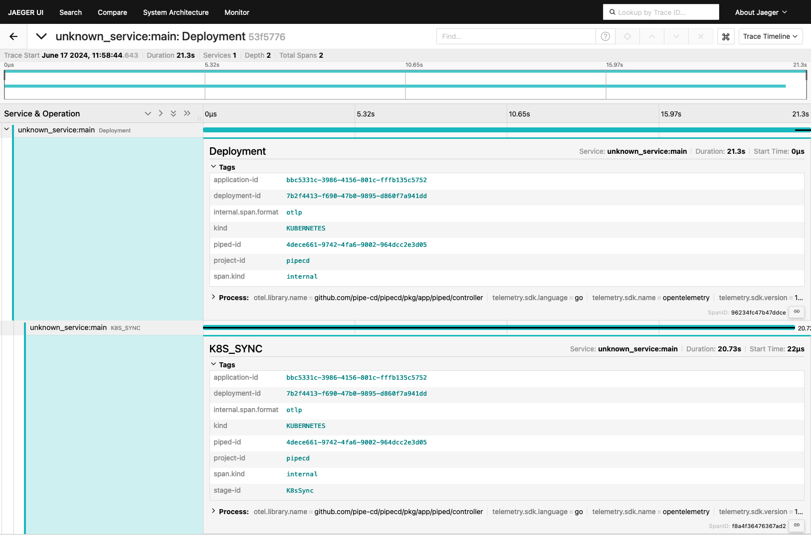
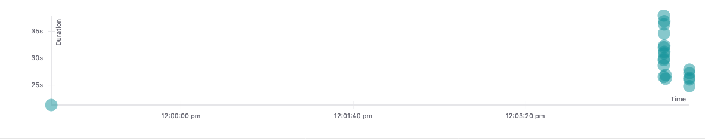

- Start Date: 2024-06-13
- Target Version: 0.49.0

# Summary

This RFC proposes a new feature to export the OpenTelemetry Trace with deployment and stage spans.

# Motivation

We want to investigate deployment performances, such as the time to complete each deployment or stage.
We have `deployment_status` metrics for now, but this metric has one metric for each deployment status, and the count of metrics variety only glows larger.
When we save all histories of such metrics, we need more storage as time goes on since the completed deployments have a 0/1 value for each status.
Conversely, if we save the histories only while it's running, we have to fill the metrics with the last value or zero to get some statistics for deployments.

So, I propose to separate the metrics to get some statistics and the traces to get deployment performances.
This RFC proposes the latter, the traces, to get deployment performances.

# Detailed design

## Architecture

Collect spans at piped
→ send to pipecd-gateway envoy
→ proxies to OpenTelemetry Collector
→ send anywhere with exporters

## How to authenticate piped at OpenTelemetry Collector

OpenTelemetry Collector has a customization feature that implements a custom authenticator.
[go.opentelemetry.io/collector/extension/auth on pkg.go.dev](https://pkg.go.dev/go.opentelemetry.io/collector/extension/auth@v0.102.1)
We can implement authentication by implementing this Client/Server interface, then using the Client at piped and the Server with a collector.

## Traces planned to collect

I plan to collect traces/spans tagged with these values.
These are not secret values, but help investigate deployment performance and problems.

- project ID
- piped ID
- application ID
- application Kind
- deployment ID
- stage Name
- stage ID

## How to use these traces

We can send traces anywhere from OpenTelemetry Collector, so we can use any hosting to collect/view traces.
This section contains sample views of traces collected with Jaeger and its usage.

P.S.
The sample images in this section are from Jaeger UI. These traces are sent directly to Jaeger from Piped, so it's not implemented the way this RFC proposes. But it's enough to take sample images.

### Detail view of deployment trace
In Jaeger UI, we can see a detailed view of a deployment.
With this view, we can inspect which stage takes much time.
In this case, it's QuickSync, so there is one and only one stage, and it takes about 20 seconds.

### Timeline view of multiple deployment traces
In Jaeger UI, we can see multiple traces in one graph.
Each point in this graph represents the duration of the trace and the time it occurred.
With this graph, we can see the performances of multiple deployments.
In this case, many deployments occurred at the same time, and there seem to be performance impacts. At the leftmost point of the graph, there is a deployment with a duration below 25s. At the rightmost point, there are many deployments with durations over 30s.

# Alternatives

Another way is to implement a custom client to send traces to the control plane. Then, the control plane sends them to the OpenTelemetry Collectors.
It's harder to maintain because we have to maintain not only the custom client but also the control plane proxy implementation.
With this RPC's proposed method, we can only maintain envoy config and authentication mechanisms.

# Unresolved questions

There is no plan for detailed implementations of custom authentication extensions for the OpenTelemetry Collector.
