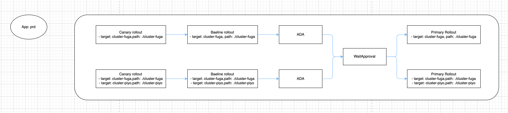

- Start Date: 2024-07-25
- Target Version: 0.49.0

# Summary

This RFC proposes a new feature for k8s app to deploy resources into multi-cluster.

# Motivation

# Usecase
- case 1. When applying the same manifest to multiple clusters for redundant configuration
- case 2. When applying manifest with some patches applied to multiple clusters for redundant configuration
- case 3. Blue/Green Deployment acress the clusters

# Detailed design

## Overview

We propose the feature to apply the manifests to multiple-clusters in one application.


## How it works

### QickSync

Piped asynchronously applies the resources to each environment based on the platform provider and resourceDir specified by the user.

For example, consider deploying a microservice called `microservice-a` to the clusters called `cluster-hoge`, `cluster-fuga`.
At first, we will prepare one application with one `app.pipecd.yaml` and some manifests like this.
Set the item `multiTarget` in spec.quickSync of app.pipecd.yaml, and set the dir containing the manifests you want to deploy and the platform provider to which you want to deploy.
This will deploy to `cluster-hoge` and `cluster-fuga` at the same time when quickSync is executed.

```
microservice-a
└── prd
    ├── app.pipecd.yaml
    ├── base
    │   ├── deployment.yaml
    │   ├── kustomization.yaml
    │   └── service.yaml
    ├── cluster-hoge
    │   └── kustomization.yaml
    ├── cluster-fuga
    │   └── kustomization.yaml
    └── kustomization.yaml
```

```app.pipecd.yaml
apiVersion: pipecd.dev/v1beta1
kind: KubernetesApp
spec:
  name: multi-cluster-app
  labels:
    env: prd
  quickSync:
    multiTarget:
      - provider:
          name: cluster-hoge # platform provider name
        resourceDir: ./cluster-hoge # the resource dir
      - provider:
          name: cluster-fuga
        resourceDir: ./cluster-fuga
```

**Rollback**

Similarly, when rolling back, multiple environments are rolled back at the same time based on the information specified in `multiTarget`.

```
apiVersion: pipecd.dev/v1beta1
kind: KubernetesApp
spec:
  name: multi-cluster-app
  labels:
    env: prd
  quickSync:
    multiTarget:
      - provider:
          name: cluster-hoge # platform provider name
        resourceDir: ./cluster-hoge # the resource dir
      - provider:
          name: cluster-fuga
        resourceDir: ./cluster-fuga
```


### PipelineSync


Piped asynchronously applies to each environment based on the platform provider and resourceDir specified by the user for each stage.

For example, consider deploying a microservice called `microservice-a` to the clusters called `cluster-hoge`, `cluster-fuga`.
At first, we will prepare one application with one `app.pipecd.yaml` and some manifests like this.
Set the item `multiTarget` in spec.quickSync of app.pipecd.yaml, and set the dir containing the manifests you want to deploy and the platform provider to which you want to deploy.
Also, set the item `multiTarget` in each stage config.
This allows applications to be applied to multiple environments at the same time when one stage is executed.

```
microservice-a
└── prd
    ├── app.pipecd.yaml
    ├── base
    │   ├── deployment.yaml
    │   ├── kustomization.yaml
    │   └── service.yaml
    ├── cluster-hoge
    │   └── kustomization.yaml
    ├── cluster-fuga
    │   └── kustomization.yaml
    └── kustomization.yaml
```

```
apiVersion: pipecd.dev/v1beta1
kind: KubernetesApp
spec:
  name: multi-cluster-app
  labels:
    env: example
    team: product
  quickSync:
    prune: true
    multiTarget:
      - provider:
          name: cluster-hoge
        resourceDir: ./cluster-hoge
      - provider:
          name: cluster-fuga
        resourceDir: ./cluster-fuga
  pipeline:
    stages:
      - name: K8S_CANARY_ROLLOUT
        with:
          replicas: 10%
          multiTarget:
            - provider:
                name: cluster-hoge
              resourceDir: ./cluster-hoge
            - provider:
                name: cluster-fuga
              resourceDir: ./cluster-fuga
...
```

**Rollback**

When rolling back, multiple environments are rolled back at the same time based on the information specified in `spec.quickSync.multiTarget`.


#### Stages to be supported

We introduce the feature into the stages where changes are made to resources on the cluster.

- K8S_PRIMARY_ROLLOUT
- K8S_CANARY_ROLLOUT
- K8S_CANARY_CLEAN
- K8S_BASELINE_ROLLOUT
- K8S_BASELINE_CLEAN
- K8S_TRAFFIC_ROUTING


### Livestate View & Drift Detection


Currently, a livestate store exists for each platform provider.
Both Livestate View and drift detection use the values ​​obtained from the livestate store based on the appID.
Also, application : platform provider = 1:1 relationship is assumed.

So we propose the improvement to obtain the all state from each platform provider using appID, like aggregation.
This achieves a relationship of application : platform provider = 1 : N.

**Livestate View**

Show livestate of all platform providers deployed by app.

**Drift Detection**

Performs Drift Detection based on the livestate of all platform providers deployed by the app.

### [option] Improve kubeconfig setup on piped

Currently, we need to prepare the kubeconfig file manually.
But it would be nice to prepare it automatically.

It might realize it by using cloud vender feature, for example using Workload Identity on GKE, or IRSA on EKS.
It means piped get kubeconfig when it starts by using them.

# Alternatives

## Idea: Execute Stages in parallel within a pipeline



### UX

- When registering an application
    - Prepare manifests for each clusters and one app.pipecd.yaml & register on UI.
    - Dir structure

```
    - /prd
        - app.pipecd.yaml
        - /base
        - /cluster-hoge
        - /cluster-fuga
```

- When deploying
    - Sync all clusters corresponding to prd.

- When rolling back
    - Roll back in the all previous state.

### Pros & Cons

**Pros**

- Only one app setting is required.
- You can operate WaitApproval for all clusters in one place.
- Flexisible stage pipeline.

**Cons**

- By realizing “parallel execution of stages”, the scheduler mechanism becomes complicated.

# Idea: Deploy to multiple Platform Providers internally


This is already implemented as PoC↓
- https://github.com/pipe-cd/pipecd/pull/3790
- https://github.com/pipe-cd/pipecd/pull/3854

## UX

- When registering an application
    - Prepare manifests for each clusters and one app.pipecd.yaml & register on UI.
    - Dir structure

```
    - /prd
        - app.pipecd.yaml
        - /base
        - /cluster-hoge
        - /cluster-fuga
```

- When deploying
    - Sync all clusters corresponding to prd.

- When rolling back
    - Roll back in the all previous state.

### Pros & Cons

**Pros**

- Only one app setting is required.
- You can operate WaitApproval for all clusters in one place.

**Cons**

- Cannot support cases where you want to change the number of replicas for only some clusters.

# Idea: Create a stage to sync apps


### UX

- When registering an application
    - Prepare one app.pipecd.yaml as a root application with sync app stage.
    - Prepare manifests and app.pipecd.yaml for each clusters and & register on UI.
    - Dir structure

```
        - /prd
            - app.pipecd.yaml
            - /base
            - /cluster-hoge
                - app.pipecd.yaml
            - /cluster-fuga
                - app.pipecd.yaml
```

- When deploying
    - Sync all clusters corresponding to prd when triggering the root app.
    - If you want to sync clusters partially, sync them as the each application.

- When rolling back
    - Roll back in the all previous state.

- Rollback時
    - You can select the following behavior by setting the stage.
        - Rollback if any app fails
        - Rollback if all apps fail
    - If the deployments of the applications triggered by the sync app stage are successful, start rollback to the previous commit.
    - If the deployments of the applications triggered by the sync app stage are in progress, cancel it.

### Pros & Cons

**Pros**

- It is possible to sync the whole or partially.
- Deployment pipelines can be configured for each environment.

**Cons**

- It takes time to set the App config.
- Need a mechanism to trigger application rollback.
- You need to OK Wait Approval for each App.
- Deployment Chain already exists as a similar function.
