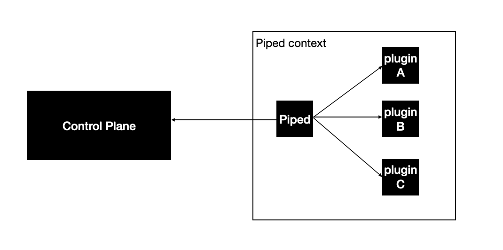
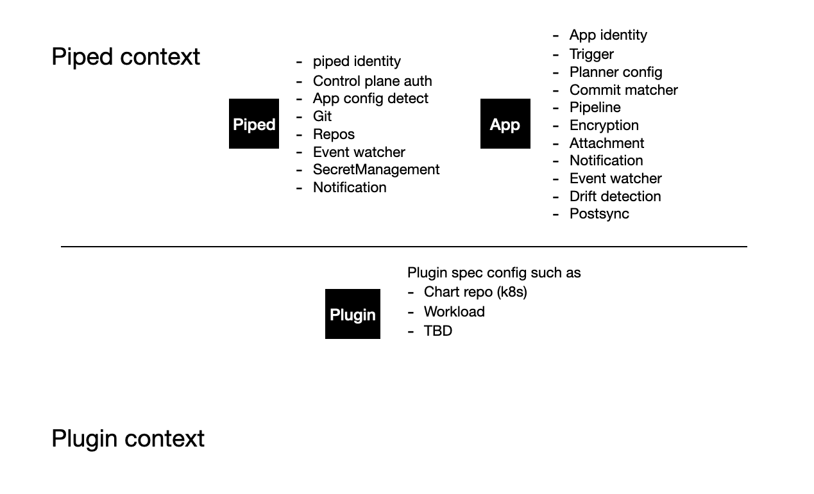

- Start Date: 2024-10-01
- Target Version: 1.0

# Summary

This can be consider as the biggest step forward to make PipeCD fit its vision: The one CD for all.

# Motivation

Up to this time, PipeCD archived several goals as its defined design in the initial stage, which included "being a consistent interface which can be used to make progressive delivery process easy for many application platforms". As its goal, the PipeCD currently supports 5 kind of application platforms, which are Kubernetes, ECS, Terraform, Lambda, and Cloud Run. But we want it not just like that, we want to make PipeCD support progressive delivery for whatever application platforms the market use today.

To achieve that goal, there is only one way, which enables PipeCD to accept new platforms as plugin of the piped agent, which can free the limit of what platform PipeCD could support as a CD system.

Also, with the power of plugin architecture, PipeCD can allow multi-versions of the same platform plugin, say the same plugin for CD on Kubernetes, but one is built-in and the other implemented by other developers. That is the future of PipeCD, and the maintainer team wants to bring it to.

# Detailed design

At the time this RFC is writen, there was serveral issues created on PipeCD main repo for tracking the plugin architecture tasks. This RFC summarizes the decisions the maintainer team has agreed to regarding the design of the PipeCD plugin architecture.

After this line in the documentation, pipedv1 is a mention to plugin-arch piped, while pipedv0 is a mention to up-to-now piped.

## The approach

We agreed that pipedv0 will be supported as least until the end of 2025, which mean we have to find a way to ensure our single PipeCD control plane can work with both pipedv0 and pipedv1 at the same time. That leads to this issue at [pipecd/issues/5252](https://github.com/pipe-cd/pipecd/issues/5252).

The key point of the control plane supports both pipedv0 and v1 approach is: platform related concepts like platform provider and kind are remained on the data model (for pipedv0), but we don't adding logic based on those concepts anymore. Pipedv1 logic will be built only around the plugins.

[draft] migration process.
1. Update data for the pipedv1
  - Add the label `kind` based on the current Application Kind to the Application.
  - Add `deployTarget`  based on the current Application Platform Provider to the Application.
2. update to pipedv1 (users can use existing application at the time)

As at this point, we have migration plan for platform related concepts in configuration as below

### For platform provider

Instead of Platform Provider, we plan to introduce the config for the plugin and define deployTargets.

**piped config**
```yaml
apiVersion: pipecd.dev/v1beta1
kind: Piped
spec:
...
  plugin:
    - name: k8s_plugin
      port: 8081
      deployTargets:
        - name: dev
          labels: 
            env: dev
          config: # depends on plugins
            masterURL: http://cluster-dev
            kubeConfigPath: ./kubeconfig-dev
```

```golang
type PipedDeployTarget struct {
	Name   string                     `json:"name"`
	Labels map[string]string          `json:"labels,omitempty"`
	Config json.RawMessage            `json:"config"`
}
```

We also plan to deploy the app to multiple targets at once in a multicluster feature for k8s.
So, we define `DeployTargets` as an array in Application and Deployment.

**Application**

```proto
message Application {
    reserved 3;
    ...
    // TODO: Add validation for this field.
    string platform_provider = 15;
    // 
    repeated string deploy_targets = 16;
    ...
}
```

**Deployment**

```proto
message Deployment {
    reserved 4;
    ...
    // The name of platform provider where to deploy this application.
    // This must be one of the provider names registered in the piped.
    string platform_provider = 11;
    
    repeated string deploy_targets = 12;
}
```

#### For the backward compatibility

Before updating the piped, users should migrate the current data on DB.
The pipedv1 uses `Platform Provider` instead of `Deploy Target`.

### For kind

Instead of Kind, we plan to introduce the label to represent the application kind.

```yaml
apiVersion: pipecd.dev/v1beta1
kind: Application
metadata:
  labels:
    kind: KUBERNETES # <- like this
spec:
  name: myApp
```

For the builtin plugins, we define 5 labels as string.
- KUBERNETES
- ECS
- LAMBDA
- CLOUDRUN
- TERRAFORM

#### For the backward compatibility

Before updating the piped, users should migrate the current data on DB.
The pipedv1 uses `Application.Labels["kind"]` instead of `Application.Kind`.

### The protocol

The protocol means to protocol used to connect between piped and its plugins.
As at the starting point, we had 2 options
- WASM
- gRPC

For less study maintaining cost, we choose gRPC. Also, other components connections in PipeCD system used gRPC as well.



Sample piped plugins configuration

```yaml
apiVersion: pipecd.dev/v1beta1
kind: Piped
spec:
...
  plugin:
    - name: k8s_plugin
      port: 8081
      sourceURL: # http or local path
      deployTargets:
        - name: dev
          labels:
            env: dev
          config: # depends on plugins
```

Boostrap flow:
- Start piped (as entrypoint of piped pod container for example)
- Piped loads plugins' configuration
- Piped pull plugins from sourceURL and places it to piped plugins dir
- Piped starts plugins with plugins configuration passed at this point
- Plugins start its grpc servers
- Plugins ping and send status ready to piped plugin management grpc server
-> ready to be used at this point

In case of failure:
- Piped failured: Restart containers / taskset as piped is the entrypoint
- Plugins failured:
  - Ping failed -> piped will be notified that plugins are not working
  - Based on piped logic, will restart the failured plugins (plugin management grpc logic)

Left over question: In case of using launcher to managing piped, and the piped failured, the launcher will restart the piped, not the plugins, in that case, how should we manage the plugins' instances effectively?

### The configuration

The configuration which up-to-now placed in piped and application (kind specific) manifests will be rearrangement as below



We need futher discussion on this but currently, we agreed to separate configuration as piped context and plugin context as above.

### The interfaces

The Piped agent has serveral main features, which are

- Plan and execute deployment
- Calculate the plan preview result
- Calculate the drift between live and "git source" manifests
- Fetch and build the state of the live manifest
- Insight feature

Across these features, we have to support 5 kinds of platforms (up to now), and each deployment we have serveral kind of stages, which are

- K8s stages
- Cloud run stages
- Terraform stages
- ECS stages
- Lambda stages
- Wait stage
- Wait approval stage
- Analysis stage
- Script run stage
- Custom sync stage (deprecated)

Based on the requirement, we would create plugins based on 3 big interfaces

- Deployment interface: response to how deployment should be done (include: plan, execute deployment tasks)
- LiveState interface: response to fetch and build state of live manifest
- Drift interface: response to calculate the drift between 2 given manifests (live - git or running - target)

Plugin can choose how and which interface it implement such as

- K8s plugin can implement all 3 interfaces
- Wait approval plugin can implement only Deployment interface (since it has nothing to deal with livestate and drift features)

Also, we may need support interface which implemented in piped side (optional) for tasks such as: Decrypt piped secret.

### The running flow

# Unresolved questions

What parts of the design are still TBD?

There are still many areas for improvement, and we welcome your ideas and suggestions.
