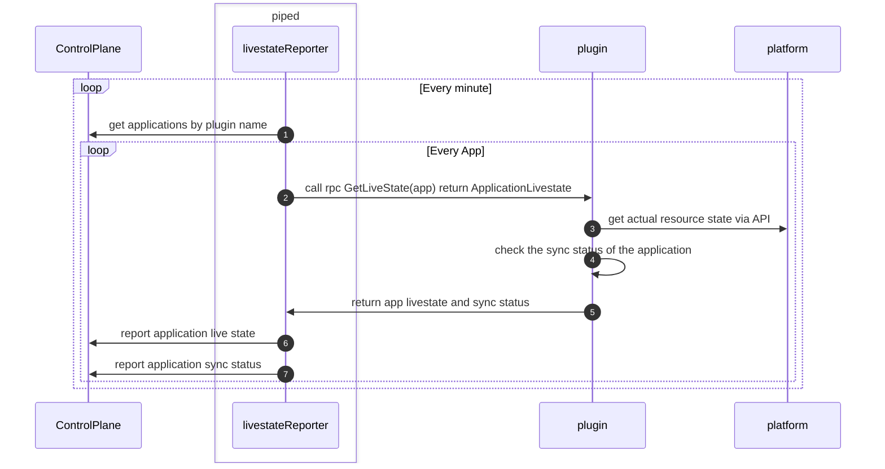

- Start Date: 2024-11-25
- Target Version: 1.0

# Summary

This is the part of the PipeCD plugin architecture.
Especially, this for the livestate feature.

# Motivation

Currently, PipeCD provides the feature that we can check the current deployed resources.
Also it supports for k8s, ECS for now. 
we want to provide the way to implement it for the specific platform in the plugin architecture.

# Detailed design

## Overview

## Livestatestore

**The purpose of the component**

- Livestatestore is used to store the actual resource state.
- This is used by three components below.
    - livestate reporter
    - detector
    - controller
      - pass it to the executor.Input and use it on the k8s stage

**Modification idea**

We decided not to implement this component to keep the plugin implementation as simple as possible.

We had the concerns to decide so but after that we could allow them to reflect another ideas.
- The pressure to the platform API (such as k8s, ecs...)
  - -> We allow it because the platform API usually scale automatically.

- The delay of the livestate view on the Web UI compared to the current speed especially k8s app case "updated by 5s".
  - -> We allow it because each deployment for the one application don't finish such a short time.

Also for detector, we decided to create livestate and sync status at one time in the plugin side.
For controller (k8s stage's pruning), we decided to get the livestate for every pruning.

## Livestatereporter

**The purpose of the component**

- Livestatereporter sends the application state to the Control Plane
- Currently, There are livestatereporters for each platform provider

**Modification idea**

- piped side
  - Every minute, piped does below
    - List apps by plugin name
    - Get the app livestate and sync status from the plugin via gRPC call e.g. `GetLivestate(app)`
    - Send them to the Control Plane
- plugin side
  - Create the livestates and sync statuses grouped by deployTarget from the platform and return to the piped.
- Control Plane side
  - Receive and store the livestates and sync statuses

