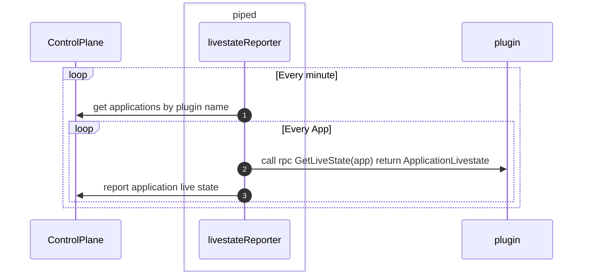

- Start Date: 2024-11-25
- Target Version: 1.0

# Summary

This is the part of the PipeCD plugin architecture.
Especially, this for the livestate feature.

# Motivation

Currently, PipeCD provides the feature that we can check the current deployed resources.
Also it supports for k8s, ECS for now. 
we want to provide the way to implement it for the specific platform in the plugin architecture.

# Detailed design

## Overview

## Livestatestore

**The purpose of the component**

- Livestatestore is used to store the actual resource state.
- This is used by three components below.
    - livestate reporter
    - detector
    - controller
      - pass it to the executor.Input and use it on the k8s stage

**Modification idea**

- Implement it on the plugin side because it is platform specific component.
- Support multiple livestates for one application because we plan to create the new feature for k8s multi cluster.

## Livestatereporter

**The purpose of the component**

- Livestatereporter sends the application state to the Control Plane
- Currently, There are livestatereporters for each platform provider

**Modification idea**

- piped side
  - Every minute, piped does below
    - List apps by plugin name
    - Get the app livestate from the plugin via gRPC call e.g. `GetLivestate(app)`
    - Send them to the Control Plane
- plugin side
  - Get the livestates grouped by deployTarget from livestatestore and return to the piped.
- Control Plane side
  - Receive and store the livestates 

**Concern**
- There is a different way to update livestate on Control Plane between k8s and other platforms.
  - other platform (ecs, cloud run, lambda) ref for cloud run: https://github.com/pipe-cd/pipecd/blob/2f86f7dca297f7f2d402c2040a4a4e14837587ab/pkg/app/piped/livestatereporter/cloudrun/report.go#L85-L86
    - Just flush livestates to the Control Plane every minute.
  - k8s: https://github.com/pipe-cd/pipecd/blob/2f86f7dca297f7f2d402c2040a4a4e14837587ab/pkg/app/piped/livestatereporter/kubernetes/reporter.go#L99-L103
    - Flush livestates to the Control Plane every 10 minutes.
    - Send the new livestates to the Control Plane every 5 seconds during the 10 minutes
- I think this is mainly for the speed to show it on the UI. 
- It would be nice to add an option like `livestateFlushInterval` to change them by users.
