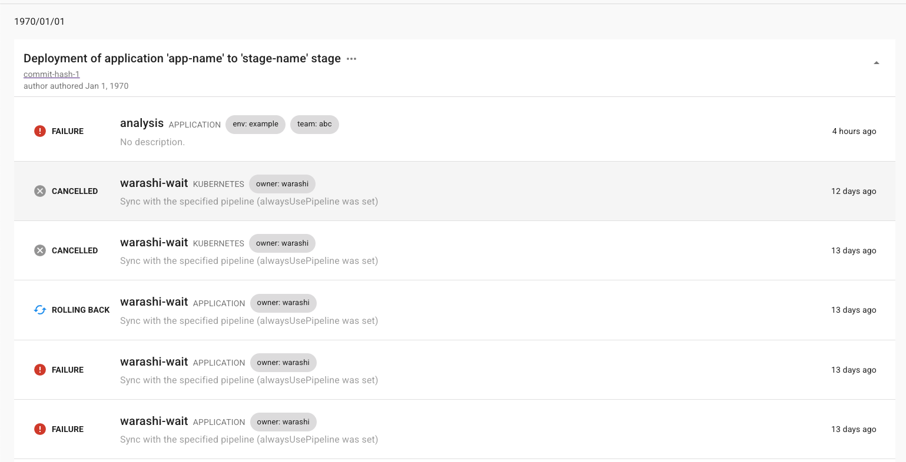

- Start Date: 2025-03-03
- Target Version: 1.0

# Summary

This is the design for PipeCD Deployment Trace feature

# Motivation

To fulfill the gap between CI & CD. The PipeCD Deployment Trace feature aims to give developer, who works with application code modification, a way to quick access and manage their deployments, which be triggered by the change they made.

This gap is naturally born due to the disconnect between CI & CD, application/source repo & manifest repo.

# Detailed design

## The UI/UX



The trace page will be added to the PipeCD web console. It's a list of deployment trace item, which each item contains:

- Deployment Trace Info: Information of commit that trigger the current deployments
- List of deployments which triggered by the commit

## Architecture

Glance of Deployment Trace model object

```proto
message DeploymentTrace {
    string id = 1 [(validate.rules).string.min_len = 1];
    string project_id = 2 [(validate.rules).string.min_len = 1];

    // Information of the commit that trigger this deployment trace.
    string title = 3;
    string commit_message = 4;
    string commit_hash = 5 [(validate.rules).string.min_len = 1];
    string commit_url = 6 [(validate.rules).string.min_len = 1];
    int64 commit_timestamp = 7 [(validate.rules).int64.gte = 0];
    string author = 8;

    int64 created_at = 101 [(validate.rules).int64.gte = 0];
    int64 updated_at = 102 [(validate.rules).int64.gte = 0];
}
```

The idea is to use `commit_hash` to the reference keys to link between a deployment trace with all deployments triggred by the same change in application repo (commit_hash referrenced commit). Once we could built the deploymen trace object that contains commit_hash and add `commit_hash` value to deployment model objects, we can query for deployment trace and show it to the UI.

The deployment model will add one field like this

```proto
message Deployment {
    ...
    // The commit hash of the deployment trace, which contains this deployment.
    string deployment_trace_commit_hash = 50;
    ...
}
```

How we build the data for Deployment Trace object?

This feature is built based on [the EventWatcher feature](https://pipecd.dev/docs/user-guide/event-watcher/) of PipeCD.


To build Deployment Trace model, we need to update the logic in the flow

(1) When an event submmitted, along with create an Event object, a Deployment Trace object will be created at the same time. The event should contain the commit_hash of triggered commit (from application repo), and users have to submit that value in order to use DeploymentTrace feature.

(3) While applying changes to manifest repo, add commit_hash of the triggered commit on application repo (source code repo) as trailer of manifest repo manifest change commit

(5) On trigger deployment, add application repo (source code repo) commit_hash stored as trailer of manifest repo commit (at (3)) as `deployment_trace_commit_hash` value in deployment model

# Think to concern

The implementation of DeploymentTrace feature solves the issue of unknow which deployments are triggered by a given application source code change from developer point of view. I think it's good enough at the moment but left from unresolved questions

1. Since deployment trace based on event watcher feature, and it's based on piped pull model, if there are multiple events sent at once, only the last submited event could be actually triggers deployments. This is not direct issue created by DeploymentTrace, but the root cause is because of PipeCD pull model on handling ControlPlane <-> Piped communication.

2. TBD
