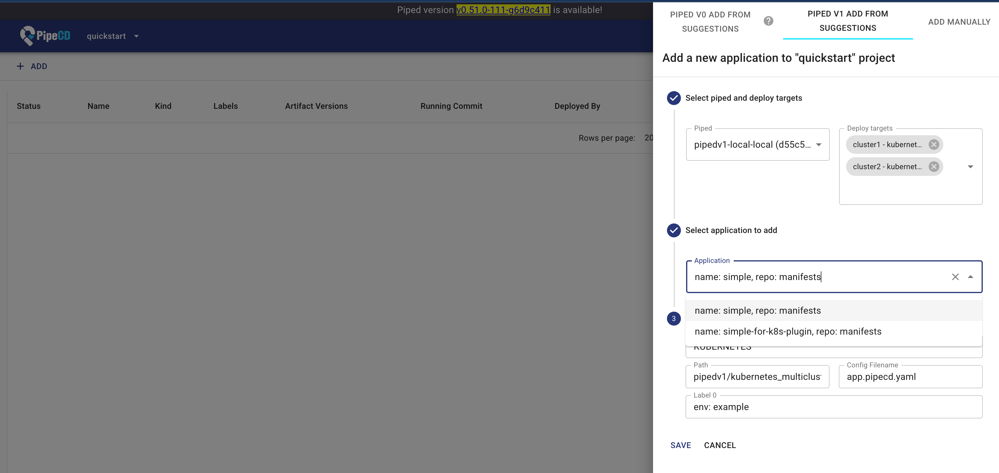

# Kubernetes Multicluster Plugin

## Specification

The current specification is described in the [RFC](../../../../../docs/rfcs/0014-multi-cluster-deployment-for-k8s.md).  
The configuration format is unstable and may change in the future.

## Try k8s multicluster plugin locally

**Prepare the PipeCD Control Plane**

Please refer to [pipe-cd/pipecd/cmd/pipecd/README.md](../../../../../cmd/pipecd/README.md) to set up the Control Plane in your local environment.

- Prepare two k8s clusters

    ```
        kind create cluster --name cluster1
        kind export kubeconfig --name cluster1 --kubeconfig /path/to/kubeconfig/for/cluster1

        kind create cluster --name cluster2
        kind export kubeconfig --name cluster2 --kubeconfig /path/to/kubeconfig/for/cluster2
    ```

**Start pipedv1 locally**

Please refer to [pipe-cd/pipecd/cmd/pipedv1/README.md](../../../../../cmd/pipedv1/README.md) to set up the Control Plane in your local environment.  
At this time, please modify the `spec.plugins` section of the piped config as shown below.

    ```yaml
    ...
      plugins:
      - name: kubernetes_multicluster
        port: 7002
        url: file:///path/to/.piped/plugins/kubernetes_multicluster # It's OK using any value for now because it's a dummy. We will implement it later.
        deployTargets: 
          - name: cluster1
            config:
              masterURL: https://127.0.0.1:61337   # shown by kubectl cluster-info
              kubeConfigPath: /path/to/kubeconfig/for/cluster1
          - name: cluster2
            config:
              masterURL: https://127.0.0.1:62082   # shown by kubectl cluster-info
              kubeConfigPath: /path/to/kubeconfig/for/cluster2
    ```

**Prepare the manifest**

- Please create a new repository for the manifest.  
If there is an app.pipecd.yaml in the format before supporting the plugin mechanism, an error will occur.

- Copy the app you want to run from the Examples and commit it.

**Register the application**



At this time, please select multiple DeployTargets.

## Examples
There are examples under `./example`.

| Name | Description |
|------|-------------|
| [simple](./example/simple/) | Deploy the same resources to the multiple clusters. |
| [multi-sources-template-none](./example/multi-sources-template-none/) | Deploy the different resources to the multiple clusters. |
